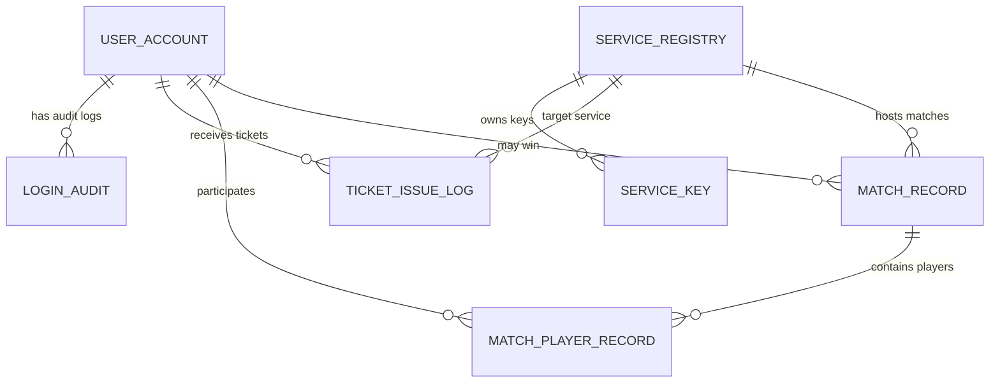
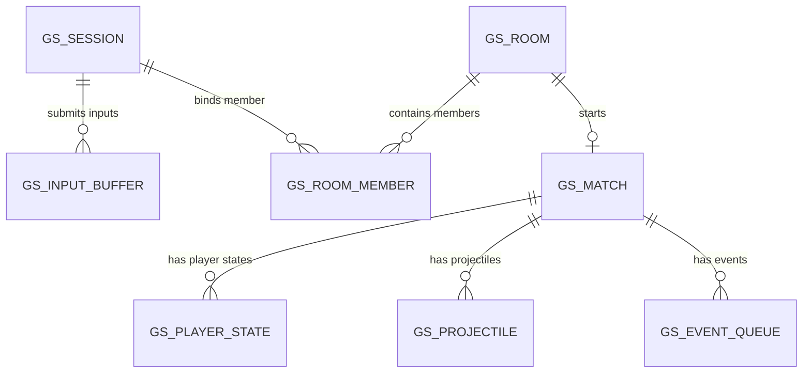

# 四、接口设计与五、数据库设计

本文用于补充《网络安全设计文档》的第四章和第五章。设计目标是把已经确定的 Slim Kerberos over WebSocket 报文格式落到“需要实现哪些函数”和“需要设计哪些数据表”两个层面。

本设计遵循以下约定：

1. 服务角色包括 Client、AS、TGS、GS 四部分。
2. 所有网络报文通过 WebSocket + UTF-8 JSON 文本帧传输。
3. 报文顶层字段围绕 `type`、`clientId`、`sessionId`、`roomId`、`ticket`、`auth`、`payload`、`error` 展开。
4. 认证阶段围绕 `ticket + auth + 加密 payload` 完成 Kerberos 风格认证。
5. 业务阶段围绕 `sessionId + roomId + payload` 完成大厅、房间和对战流程。
6. 持久化数据库只保存用户、认证参数、服务配置、审计日志和低频结算结果；房间、对战状态、输入队列、快照、投射物等高频状态保存在 GS 内存中。

---

# 四、接口设计

## 4.1 接口设计总体说明

本系统的接口分为五类：

1. 公共协议与安全接口：由 Client、AS、TGS、GS 共同使用，负责消息封装、字段校验、加密解密、票据处理和防重放校验。
2. 客户端接口：由 Unity 客户端调用，负责注册、登录、申请票据、连接 GS、房间操作、输入发送和快照处理。
3. AS 服务端接口：由认证服务器实现，负责注册、登录、修改密码、签发 TGT 和维护 `loginGen`。
4. TGS 服务端接口：由票据授予服务器实现，负责验证 TGT，并签发访问目标 GS 的 Service Ticket。
5. GS 服务端接口：由游戏服务器实现，负责验证 Service Ticket、建立 `sessionId`、管理房间、推进对战、广播快照、处理重连和生成结算结果。
6. 数据访问接口：由服务端调用，负责访问 MySQL 中的用户、服务配置、密钥配置、日志和结算记录。

本节中的函数命名采用 `lowerCamelCase`，具体实现时 Python 服务端可以转换为 `snake_case`，Unity C# 客户端可以转换为 `PascalCase`。

## 4.2 统一数据结构

### 4.2.1 ProtocolMessage

`ProtocolMessage` 是所有 WebSocket 消息的统一外层结构。

| 字段 | 类型 | 是否必需 | 说明 |
|---|---|---|---|
| `type` | `string` | 是 | 消息类型，所有接收端先根据该字段分发处理 |
| `clientId` | `string` | 认证阶段常用 | 客户端实例 ID，用于区分同一账号的不同客户端实例 |
| `sessionId` | `string` | GS 业务阶段必需 | GS 认证成功后生成的业务会话 ID |
| `roomId` | `string` | 房间/对战阶段使用 | 房间号，同时也是玩家输入的入房码 |
| `ticket` | `string` | 认证阶段使用 | TGT 或 Service Ticket，Base64 字符串 |
| `auth` | `string` | TGS/GS 认证阶段使用 | Authenticator，Base64 密文 |
| `payload` | `string` | 大多数消息使用 | 普通 JSON 字符串或 Base64 密文字符串 |
| `error` | `string` | 错误消息使用 | 机器可读错误码 |

### 4.2.2 AuthContext

客户端认证上下文，保存在客户端内存中。

| 字段 | 类型 | 说明 |
|---|---|---|
| `clientId` | `string` | 当前客户端实例 ID |
| `userId` | `long` | 当前登录用户 ID |
| `username` | `string` | 当前用户名 |
| `tgt` | `string` | AS 返回的 TGT |
| `kcTgs` | `string` | Client 与 TGS 的会话密钥 |
| `serviceTicket` | `string` | TGS 返回的 Service Ticket |
| `kcGs` | `string` | Client 与 GS 的会话密钥 |
| `sessionId` | `string` | GS 返回的业务会话 ID |
| `loginGen` | `int` | 当前登录代数 |
| `ticketExpireAt` | `long` | 票据过期时间 |
| `lastProcessedSeq` | `long` | 最近一次被 GS 确认的输入序号 |

### 4.2.3 InputPayload

客户端发送给 GS 的输入载荷结构。

| 字段 | 类型 | 说明 |
|---|---|---|
| `seq` | `long` | 输入序号，客户端单调递增 |
| `tick` | `long` | 客户端本地模拟帧号 |
| `moveX` | `float` | 水平移动输入，建议取值范围为 -1 到 1 |
| `jumpPressed` | `bool` | 本帧是否刚按下跳跃 |
| `downHeld` | `bool` | 是否持续按住下方向 |
| `dropPressed` | `bool` | 是否触发下落或穿台 |
| `attackPressed` | `bool` | 本帧是否刚按下攻击 |
| `attackHeld` | `bool` | 本帧是否持续按住攻击 |
| `attackReleased` | `bool` | 本帧是否刚松开攻击 |
| `aimX` | `float` | 瞄准方向 X |
| `aimY` | `float` | 瞄准方向 Y |
| `clientState` | `string` | 客户端当前状态名，仅作摘要和调试 |
| `clientGrounded` | `bool` | 客户端认为自己是否着地 |
| `clientJumpCount` | `int` | 客户端记录的跳跃次数 |
| `clientPosX` | `float` | 客户端本地预测位置 X |
| `clientPosY` | `float` | 客户端本地预测位置 Y |
| `clientVelX` | `float` | 客户端本地预测速度 X |
| `clientVelY` | `float` | 客户端本地预测速度 Y |
| `equippedWeaponId` | `string` | 当前装备武器 ID |
| `equippedEffectIds` | `string[]` | 当前装备武器挂载的 Effect ID 列表 |

---

## 4.3 公共协议与安全接口

| 函数名称 | 函数参数 | 函数输出 | 函数作用 |
|---|---|---|---|
| `parseMessage` | `rawText: string` | `ProtocolMessage` | 将 WebSocket 文本帧解析为统一消息对象；解析失败时返回或抛出 `BAD_JSON` 错误 |
| `buildMessage` | `type: string, fields: MessageFields` | `string` | 按统一顶层字段构造 JSON 文本帧，未使用字段直接省略 |
| `requireFields` | `msg: ProtocolMessage, fields: string[]` | `void / ErrorCode` | 根据消息类型检查必需字段是否存在 |
| `parsePayloadJson` | `payload: string` | `JsonObject` | 将普通 JSON 字符串形式的 `payload` 解析为对象 |
| `buildPayloadJson` | `obj: JsonObject` | `string` | 将业务对象序列化为普通 JSON 字符串形式的 `payload` |
| `rsaEncryptPayload` | `obj: JsonObject, publicKey: RsaPublicKey` | `string` | 使用 AS 公钥加密注册、登录、修改密码等敏感请求体，并返回 Base64 字符串 |
| `rsaDecryptPayload` | `cipher: string, privateKey: RsaPrivateKey` | `JsonObject` | AS 使用私钥解开 RSA 保护的敏感请求体 |
| `desEncryptObject` | `key: bytes, obj: JsonObject` | `string` | 使用 DES-CBC 加密对象，返回 `Base64(IV \|\| CipherText)` |
| `desDecryptObject` | `key: bytes, cipher: string` | `JsonObject` | 解开 DES-CBC 密文并解析为 JSON 对象 |
| `deriveKuser` | `password: string, salt: bytes, iter: int` | `bytes` | 客户端根据用户密码、盐值和 PBKDF2 迭代次数派生 `Kuser` |
| `hashPassword` | `password: string, salt: bytes, iter: int` | `bytes` | AS 注册或修改密码时生成密码摘要 |
| `verifyPasswordHash` | `password: string, salt: bytes, iter: int, hash: bytes` | `bool` | AS 登录或修改密码时校验口令是否正确 |
| `generateSessionKey` | 无 | `bytes` | 生成 8 字节 DES 会话密钥，用于 `KcTgs` 或 `KcGs` |
| `generateNonce` | 无 | `string` | 生成认证器和请求载荷中的随机串 |
| `nowMs` | 无 | `long` | 返回当前 Unix 毫秒时间戳 |
| `checkTimeWindow` | `ts: long, now: long, windowMs: int = 30000` | `bool` | 校验认证时间戳是否处于 30 秒允许窗口内 |
| `buildAuthenticator` | `key: bytes, ts: long, nonce: string, sessionId?: string` | `string` | 构造并加密 Authenticator；重连时额外写入 `sessionId` |
| `verifyAuthenticator` | `auth: string, key: bytes, ticketHash: string, replayCache: ReplayCache` | `AuthPlain / ErrorCode` | 解密认证器，校验时间窗口和 `(ticketHash, nonce, ts)` 是否重放 |
| `issueTgt` | `plain: TgtPlain, ktgs: bytes` | `string` | AS 使用 `K_tgs` 加密签发 TGT |
| `decryptTgt` | `ticket: string, ktgs: bytes` | `TgtPlain / ErrorCode` | TGS 使用 `K_tgs` 解开并校验 TGT |
| `issueServiceTicket` | `plain: ServiceTicketPlain, kgs: bytes` | `string` | TGS 使用目标 GS 的 `K_gs` 加密签发 Service Ticket |
| `decryptServiceTicket` | `ticket: string, kgs: bytes` | `ServiceTicketPlain / ErrorCode` | GS 使用 `K_gs` 解开并校验 Service Ticket |
| `checkTicketExpire` | `exp: long, now: long` | `bool` | 校验 TGT 或 Service Ticket 是否过期 |
| `checkLoginGen` | `userId: long, loginGen: int` | `bool` | 查询数据库中用户当前 `loginGen`，判断票据是否仍有效 |
| `ticketHash` | `ticket: string` | `string` | 对票据密文做 SHA-256 摘要，用于防重放缓存和日志记录 |
| `buildError` | `errorCode: string, sessionId?: string, roomId?: string` | `ProtocolMessage` | 构造统一 `ERROR` 消息 |

---

## 4.4 客户端接口

客户端接口主要由 Unity UI、认证接入模块、房间管理模块、输入采集模块、本地预测模块和表现同步模块调用。

| 函数名称 | 函数参数 | 函数输出 | 函数作用 |
|---|---|---|---|
| `initClient` | `asUrl: string, tgsUrl: string, gsUrl: string` | `void` | 初始化客户端网络端点和本地上下文 |
| `generateClientId` | 无 | `string` | 生成本次客户端进程使用的 `clientId` |
| `registerAsync` | `username: string, password: string` | `RegisterResult { ok, userId, error }` | 向 AS 发送 `REGISTER_REQ`，创建新账号 |
| `loginAsync` | `username: string, password: string` | `LoginResult { ok, userId, tgt, kcTgs, exp, loginGen, error }` | 向 AS 发送 `AS_REQ`，获取 TGT 和 `KcTgs` |
| `changePasswordAsync` | `username: string, oldPassword: string, newPassword: string` | `ChangePasswordResult { ok, error }` | 向 AS 发送 `CHANGE_PASSWORD_REQ`，成功后清理本地旧票据 |
| `requestGsTicketAsync` | `service: string` | `TicketResult { ok, serviceTicket, kcGs, exp, error }` | 向 TGS 发送 `TGS_REQ`，用 TGT 换取访问目标 GS 的 Service Ticket |
| `authenticateGsAsync` | `serviceTicket: string, kcGs: bytes` | `SessionResult { ok, sessionId, exp, error }` | 向 GS 发送 `GS_AUTH`，完成双向认证并获取 `sessionId` |
| `reconnectAsync` | `lastProcessedSeq: long` | `ReconnectResult { ok, sessionId, roomId, phase, lastProcessedSeq, error }` | 断线后发送 `RECONNECT_REQ`，恢复旧业务会话 |
| `logoutAsync` | 无 | `LogoutResult { ok, error }` | 向 GS 发送 `LOGOUT_REQ`，清理本地业务上下文 |
| `clearAuthContext` | `reason: string` | `void` | 清理 TGT、Service Ticket、`KcTgs`、`KcGs`、`sessionId` 等安全上下文 |
| `listRoomsAsync` | 无 | `RoomSummary[]` | 向 GS 发送 `ROOM_LIST_REQ`，获取当前可见房间列表 |
| `createRoomAsync` | `mapId?: string` | `RoomCreateResult { ok, roomId, error }` | 向 GS 发送 `ROOM_CREATE_REQ`，创建房间并加入房间 |
| `joinRoomAsync` | `roomId: string` | `RoomJoinResult { ok, roomId, error }` | 向 GS 发送 `ROOM_JOIN_REQ`，按房间号加入房间 |
| `leaveRoomAsync` | `roomId: string` | `RoomLeaveResult { ok, error }` | 向 GS 发送 `ROOM_LEAVE_REQ`，离开当前房间 |
| `setReadyAsync` | `roomId: string, ready: bool` | `ReadyResult { ok, ready, error }` | 向 GS 发送 `ROOM_READY_REQ`，显式设置准备状态 |
| `startRoomAsync` | `roomId: string` | `StartResult { ok, matchId, countdownMs, error }` | 房主向 GS 发送 `ROOM_START_REQ`，请求开始对战 |
| `sendHeartbeatAsync` | 无 | `HeartbeatResult { ok, error }` | 周期性发送 `HEARTBEAT_REQ`，维持在线状态 |
| `collectInput` | `unityInputState: UnityInputState` | `InputPayload` | 从 Unity 输入系统采集移动、跳跃、攻击、瞄准和武器效果信息 |
| `sendInput` | `input: InputPayload` | `void` | 向 GS 发送 `INPUT`，并将该输入加入未确认输入队列 |
| `onRoomState` | `msg: ProtocolMessage` | `void` | 处理 `ROOM_STATE`，整体替换本地房间视图 |
| `onSnapshot` | `msg: ProtocolMessage` | `void` | 处理 `SNAPSHOT`，确认输入、回滚重放、更新玩家和投射物视图 |
| `onResult` | `msg: ProtocolMessage` | `void` | 处理 `RESULT`，展示胜负、原因和玩家结算摘要 |
| `onError` | `msg: ProtocolMessage` | `void` | 根据 `error` 执行界面提示、状态刷新或上下文清理 |
| `onForceLogout` | `msg: ProtocolMessage` | `void` | 处理 `FORCE_LOGOUT`，立即清理认证和业务上下文并返回登录界面 |

---

## 4.5 AS 服务端接口

AS 负责注册、登录、修改密码、签发 TGT 和维护用户 `loginGen`。

| 函数名称 | 函数参数 | 函数输出 | 函数作用 |
|---|---|---|---|
| `startAsServer` | `host: string, port: int` | `void` | 启动 AS WebSocket 服务 |
| `dispatchAsMessage` | `conn: WebSocketConn, msg: ProtocolMessage` | `void` | 根据 `type` 将消息分发给 AS 对应处理函数 |
| `handleRegisterReq` | `conn: WebSocketConn, msg: ProtocolMessage` | `REGISTER_REP / ERROR` | 处理 `REGISTER_REQ`，解密注册材料，创建用户账号 |
| `handleAsReq` | `conn: WebSocketConn, msg: ProtocolMessage` | `AS_REP / ERROR` | 处理 `AS_REQ`，校验用户名密码，签发 TGT 和 `KcTgs` |
| `handleChangePasswordReq` | `conn: WebSocketConn, msg: ProtocolMessage` | `CHANGE_PASSWORD_REP / ERROR` | 处理 `CHANGE_PASSWORD_REQ`，校验旧密码，更新新密码并递增 `loginGen` |
| `createUser` | `username: string, password: string` | `UserAccount / ErrorCode` | 创建用户，生成盐值、密码摘要、PBKDF2 参数和初始 `loginGen` |
| `findUserForLogin` | `username: string` | `UserAccount / null` | 根据用户名查询用户认证信息 |
| `verifyUserPassword` | `user: UserAccount, password: string` | `bool` | 校验登录密码是否正确 |
| `updateUserPassword` | `userId: long, newPassword: string` | `void` | 更新密码盐值、密码摘要和 PBKDF2 参数 |
| `increaseLoginGen` | `userId: long, reason: string` | `int` | 将用户 `loginGen` 加一，使旧 TGT、旧 Service Ticket 和旧 GS 会话失效 |
| `buildAsRep` | `user: UserAccount, clientId: string, nonce: string` | `ProtocolMessage` | 生成 `AS_REP`，顶层 `ticket` 放 TGT，`payload.part` 用 `Kuser` 加密 |
| `recordAsAudit` | `userId?: long, username: string, clientId: string, eventType: string, success: bool, error?: string` | `void` | 写入注册、登录、改密等审计日志 |
| `loadTgsKey` | 无 | `bytes` | 从服务密钥配置中加载 `K_tgs` |
| `loadAsRsaKeyPair` | 无 | `RsaKeyPair` | 加载 AS 的 RSA 密钥对，用于解密客户端敏感请求体 |

### AS 支持的外部消息

| 报文类型 | 处理函数 | 成功响应 | 失败响应 |
|---|---|---|---|
| `REGISTER_REQ` | `handleRegisterReq` | `REGISTER_REP` | `ERROR` |
| `AS_REQ` | `handleAsReq` | `AS_REP` | `ERROR` |
| `CHANGE_PASSWORD_REQ` | `handleChangePasswordReq` | `CHANGE_PASSWORD_REP` | `ERROR` |

---

## 4.6 TGS 服务端接口

TGS 负责验证 TGT，将“已通过 AS 认证的客户端”转换为“被授权访问某个 GS 的客户端”。

| 函数名称 | 函数参数 | 函数输出 | 函数作用 |
|---|---|---|---|
| `startTgsServer` | `host: string, port: int` | `void` | 启动 TGS WebSocket 服务 |
| `dispatchTgsMessage` | `conn: WebSocketConn, msg: ProtocolMessage` | `void` | 根据 `type` 将消息分发给 TGS 对应处理函数 |
| `handleTgsReq` | `conn: WebSocketConn, msg: ProtocolMessage` | `TGS_REP / ERROR` | 处理 `TGS_REQ`，验证 TGT 和认证器，签发 Service Ticket |
| `validateTgt` | `clientId: string, ticket: string` | `TgtPlain / ErrorCode` | 解密并校验 TGT，包括 `clientId`、过期时间和 `loginGen` |
| `validateTgsAuthenticator` | `auth: string, kcTgs: bytes, ticketHash: string` | `AuthPlain / ErrorCode` | 校验使用 `KcTgs` 加密的 Authenticator，防止重放 |
| `decryptTgsReqPayload` | `payload: string, kcTgs: bytes` | `ServiceRequestPlain / ErrorCode` | 解密客户端申请目标服务的请求体，读取 `service` 和 `nonce` |
| `findTargetService` | `service: string` | `ServiceRegistry / ErrorCode` | 从服务注册表查询目标 GS 是否存在且可用 |
| `loadServiceKey` | `serviceId: long, keyUsage: string` | `bytes` | 加载目标服务密钥，例如目标 GS 的 `K_gs` |
| `issueGsServiceTicket` | `tgt: TgtPlain, service: ServiceRegistry, kcGs: bytes` | `string` | 生成绑定目标 GS 的 Service Ticket |
| `buildTgsRep` | `ticket: string, kcTgs: bytes, kcGs: bytes, nonce: string, exp: long` | `ProtocolMessage` | 生成 `TGS_REP`，返回 Service Ticket 和用 `KcTgs` 保护的 `KcGs` |
| `recordTicketIssue` | `userId: long, clientId: string, ticketType: string, serviceId: long, ticketHash: string, exp: long` | `void` | 记录 TGT 或 Service Ticket 签发日志，不保存票据明文 |

### TGS 支持的外部消息

| 报文类型 | 处理函数 | 成功响应 | 失败响应 |
|---|---|---|---|
| `TGS_REQ` | `handleTgsReq` | `TGS_REP` | `ERROR` |

---

## 4.7 GS 服务端接口

GS 负责验证 Service Ticket、建立业务会话、管理房间、处理对战同步、处理断线重连并生成比赛结果。

| 函数名称 | 函数参数 | 函数输出 | 函数作用 |
|---|---|---|---|
| `startGsServer` | `host: string, port: int` | `void` | 启动 GS WebSocket 服务 |
| `dispatchGsMessage` | `conn: WebSocketConn, msg: ProtocolMessage` | `void` | 根据 `type` 进行消息分发；未认证连接只允许 `GS_AUTH` 或 `RECONNECT_REQ` |
| `handleGsAuth` | `conn: WebSocketConn, msg: ProtocolMessage` | `GS_AUTH_OK / ERROR` | 处理 `GS_AUTH`，验证 Service Ticket 和认证器，建立 `sessionId` |
| `handleReconnectReq` | `conn: WebSocketConn, msg: ProtocolMessage` | `RECONNECT_REP / ERROR` | 处理 `RECONNECT_REQ`，验证旧票据和旧 `sessionId`，恢复断线会话 |
| `handleLogoutReq` | `conn: WebSocketConn, msg: ProtocolMessage` | `LOGOUT_REP / ERROR` | 处理 `LOGOUT_REQ`，清理会话、房间成员和重连状态 |
| `handleHeartbeatReq` | `conn: WebSocketConn, msg: ProtocolMessage` | `HEARTBEAT_REP / ERROR` | 处理 `HEARTBEAT_REQ`，刷新会话在线时间 |
| `handleRoomListReq` | `conn: WebSocketConn, msg: ProtocolMessage` | `ROOM_LIST_REP / ERROR` | 返回当前可见房间摘要 |
| `handleRoomCreateReq` | `conn: WebSocketConn, msg: ProtocolMessage` | `ROOM_CREATE_REP / ERROR` | 创建新房间，将创建者加入房间并广播 `ROOM_STATE` |
| `handleRoomJoinReq` | `conn: WebSocketConn, msg: ProtocolMessage` | `ROOM_JOIN_REP / ERROR` | 按 `roomId` 加入房间，成功后广播 `ROOM_STATE` |
| `handleRoomLeaveReq` | `conn: WebSocketConn, msg: ProtocolMessage` | `ROOM_LEAVE_REP / ERROR` | 离开房间，处理房主转移、房间销毁或状态广播 |
| `handleRoomReadyReq` | `conn: WebSocketConn, msg: ProtocolMessage` | `ROOM_READY_REP / ERROR` | 显式设置准备状态，成功后广播 `ROOM_STATE` |
| `handleRoomStartReq` | `conn: WebSocketConn, msg: ProtocolMessage` | `ROOM_START_REP / ERROR` | 房主请求开始对战；检查人数、准备状态和房间状态 |
| `handleInput` | `conn: WebSocketConn, msg: ProtocolMessage` | `void / ERROR` | 接收 `INPUT`，写入输入队列，由权威模拟循环消费 |
| `validateServiceTicket` | `clientId: string, ticket: string` | `ServiceTicketPlain / ErrorCode` | 解密并校验 Service Ticket，包括目标服务、过期时间和 `loginGen` |
| `validateGsAuthenticator` | `auth: string, kcGs: bytes, ticketHash: string` | `AuthPlain / ErrorCode` | 校验使用 `KcGs` 加密的 Authenticator，防止重放 |
| `createSession` | `conn: WebSocketConn, ticket: ServiceTicketPlain` | `Session` | 创建业务会话，生成唯一 `sessionId` |
| `bindConnection` | `sessionId: string, conn: WebSocketConn` | `void` | 将 WebSocket 连接与业务会话绑定 |
| `validateSession` | `sessionId: string` | `Session / ErrorCode` | 检查 `sessionId` 是否存在、未过期、未被强制下线 |
| `enterReconnectGrace` | `sessionId: string` | `void` | 连接断开时将会话标记为可重连宽限状态 |
| `resumeSession` | `sessionId: string, conn: WebSocketConn, lastProcessedSeq: long` | `ReconnectResult` | 重连成功后恢复连接、房间和对战上下文 |
| `generateRoomId` | 无 | `string` | 生成 6 位唯一房间号 |
| `createRoom` | `ownerSession: Session, mapId?: string` | `Room` | 创建房间对象，设置房主和初始状态 |
| `joinRoom` | `session: Session, roomId: string` | `RoomJoinResult` | 将玩家加入指定房间，分配槽位 |
| `leaveRoom` | `session: Session, roomId: string` | `RoomLeaveResult` | 移除房间成员，处理房主转移或房间清理 |
| `setReady` | `session: Session, roomId: string, ready: bool` | `ReadyResult` | 设置玩家准备状态 |
| `broadcastRoomState` | `roomId: string` | `void` | 向房间内所有在线成员广播权威 `ROOM_STATE` |
| `canStartMatch` | `room: Room, requester: Session` | `bool / ErrorCode` | 检查是否满足开始比赛条件 |
| `startMatch` | `room: Room` | `Match` | 创建对战上下文，初始化玩家状态、tick、输入队列和事件队列 |
| `enqueueInput` | `session: Session, roomId: string, input: InputPayload` | `void / ErrorCode` | 将客户端输入按 `seq` 写入输入缓冲区 |
| `consumeInputs` | `match: Match` | `InputBatch` | 按逻辑帧消费玩家输入；缺失输入时按空输入处理 |
| `advanceMatchTick` | `match: Match, inputs: InputBatch` | `void` | 按权威逻辑推进移动、跳跃、攻击、投射物、伤害、击飞和命数 |
| `buildSnapshot` | `match: Match, targetSession?: Session` | `ProtocolMessage` | 组装 `SNAPSHOT`，包含 tick、lastProcessedSeq、players、projectiles、events |
| `broadcastSnapshot` | `match: Match` | `void` | 向对战中的所有在线玩家广播权威快照 |
| `settleMatch` | `match: Match, reason: string` | `ResultPayload` | 判断胜者、结束原因和玩家结算摘要 |
| `broadcastResult` | `match: Match, result: ResultPayload` | `void` | 向房间内玩家广播 `RESULT` |
| `persistMatchResult` | `match: Match, result: ResultPayload` | `void` | 将低频结算结果写入 MySQL，不保存高频帧状态 |
| `cleanupMatch` | `matchId: string` | `void` | 清理内存中的对战状态、输入队列、投射物和事件队列 |
| `cleanupExpiredSessions` | 无 | `void` | 定时清理过期票据、超时重连会话和无效房间 |

### GS 支持的外部消息

| 报文类型 | 处理函数 | 成功响应 | 失败响应 |
|---|---|---|---|
| `GS_AUTH` | `handleGsAuth` | `GS_AUTH_OK` | `ERROR` |
| `RECONNECT_REQ` | `handleReconnectReq` | `RECONNECT_REP` | `ERROR` |
| `LOGOUT_REQ` | `handleLogoutReq` | `LOGOUT_REP` | `ERROR` |
| `HEARTBEAT_REQ` | `handleHeartbeatReq` | `HEARTBEAT_REP` | `ERROR` |
| `ROOM_LIST_REQ` | `handleRoomListReq` | `ROOM_LIST_REP` | `ERROR` |
| `ROOM_CREATE_REQ` | `handleRoomCreateReq` | `ROOM_CREATE_REP` 和 `ROOM_STATE` | `ERROR` |
| `ROOM_JOIN_REQ` | `handleRoomJoinReq` | `ROOM_JOIN_REP` 和 `ROOM_STATE` | `ERROR` |
| `ROOM_LEAVE_REQ` | `handleRoomLeaveReq` | `ROOM_LEAVE_REP` 和 `ROOM_STATE` | `ERROR` |
| `ROOM_READY_REQ` | `handleRoomReadyReq` | `ROOM_READY_REP` 和 `ROOM_STATE` | `ERROR` |
| `ROOM_START_REQ` | `handleRoomStartReq` | `ROOM_START_REP` 和 `ROOM_STATE` | `ERROR` |
| `INPUT` | `handleInput` | 后续由 `SNAPSHOT` 确认 | `ERROR` |

---

## 4.8 数据访问接口

| 函数名称 | 函数参数 | 函数输出 | 函数作用 |
|---|---|---|---|
| `UserRepository.create` | `username, passwordHash, salt, iter` | `UserAccount` | 插入新用户账号 |
| `UserRepository.findByUsername` | `username: string` | `UserAccount / null` | 按用户名查询用户 |
| `UserRepository.findById` | `userId: long` | `UserAccount / null` | 按用户 ID 查询用户 |
| `UserRepository.updatePassword` | `userId, passwordHash, salt, iter` | `void` | 更新用户密码摘要和参数 |
| `UserRepository.incrementLoginGen` | `userId: long` | `int` | 递增并返回新的 `loginGen` |
| `UserRepository.getLoginGen` | `userId: long` | `int` | 查询当前 `loginGen`，供 TGS/GS 验证票据 |
| `ServiceRepository.findByName` | `serviceName: string` | `ServiceRegistry / null` | 查询目标服务配置 |
| `ServiceRepository.findById` | `serviceId: long` | `ServiceRegistry / null` | 按服务 ID 查询服务配置 |
| `ServiceKeyRepository.getEnabledKey` | `serviceId: long, keyUsage: string` | `ServiceKey` | 查询当前可用服务密钥配置 |
| `AuditRepository.insertLoginAudit` | `LoginAuditRecord` | `void` | 写入注册、登录、修改密码、登出等审计日志 |
| `TicketLogRepository.insert` | `TicketIssueRecord` | `void` | 写入票据签发日志，只保存票据摘要 |
| `MatchRecordRepository.insertMatch` | `MatchRecord` | `void` | 写入比赛结算主记录 |
| `MatchRecordRepository.insertPlayers` | `MatchPlayerRecord[]` | `void` | 写入比赛参与玩家结算记录 |

---

## 4.9 接口调用主流程

### 4.9.1 注册与登录流程

```text
Client.registerAsync
  -> AS.handleRegisterReq
  -> UserRepository.create
  <- REGISTER_REP

Client.loginAsync
  -> AS.handleAsReq
  -> UserRepository.findByUsername
  -> verifyUserPassword
  -> increaseLoginGen
  -> issueTgt
  <- AS_REP
```

### 4.9.2 申请 GS 票据流程

```text
Client.requestGsTicketAsync
  -> TGS.handleTgsReq
  -> decryptTgt
  -> checkLoginGen
  -> validateTgsAuthenticator
  -> ServiceRepository.findByName
  -> issueServiceTicket
  <- TGS_REP
```

### 4.9.3 接入 GS 与业务流程

```text
Client.authenticateGsAsync
  -> GS.handleGsAuth
  -> decryptServiceTicket
  -> checkLoginGen
  -> validateGsAuthenticator
  -> createSession
  <- GS_AUTH_OK

Client.createRoomAsync / joinRoomAsync / setReadyAsync / startRoomAsync
  -> GS 房间处理接口
  <- ROOM_*_REP + ROOM_STATE

Client.sendInput
  -> GS.handleInput
  -> enqueueInput
  -> advanceMatchTick
  <- SNAPSHOT / RESULT
```

### 4.9.4 断线重连流程

```text
WebSocket 断开
  -> GS.enterReconnectGrace

Client.reconnectAsync
  -> GS.handleReconnectReq
  -> validateServiceTicket
  -> validateGsAuthenticator
  -> resumeSession
  <- RECONNECT_REP
  <- ROOM_STATE
  <- SNAPSHOT
```

---

# 五、数据库设计

## 5.1 数据库部署设计

### 5.1.1 部署原则

系统采用“认证数据持久化、对战状态内存化”的数据设计原则：

1. `user_account`、`service_registry`、`service_key` 等认证和服务配置数据持久化到 MySQL。
2. TGT、Service Ticket、`KcTgs`、`KcGs`、`sessionId`、房间状态、对战状态、输入队列、快照和投射物状态不作为高频数据写入 MySQL。
3. GS 可以在比赛结束后把低频结算结果写入 MySQL，用于战绩查询或调试复盘；但不按每个 tick 写入玩家位置、输入和投射物状态。
4. 客户端不部署数据库，只在内存中缓存当前认证上下文和对战回滚所需的未确认输入队列。

### 5.1.2 推荐部署拓扑

| 节点 | 示例地址 | 部署内容 | 数据职责 |
|---|---|---|---|
| Client | 玩家本机 | Unity 客户端 | 不部署数据库；仅缓存 `clientId`、票据、会话密钥、`sessionId`、未确认输入队列 |
| AS | `10.0.0.11:9000` | 认证服务器 | 读写用户账号、密码参数、`loginGen`、注册/登录审计日志 |
| TGS | `10.0.0.11:9001` | 票据授予服务器 | 读取用户 `loginGen`、服务注册表、服务密钥；写入票据签发日志 |
| GS | `10.0.0.12:9100` | 游戏服务器 | 读取用户 `loginGen` 和 GS 服务密钥；内存维护会话、房间和对战状态；比赛结束后写入结算记录 |
| MySQL/AuthDB | `10.0.0.10:3306` 或与 AS 同机 | 共享认证数据库 | 保存用户、服务、密钥、审计、票据日志和结算结果 |

课程设计环境中可以将 MySQL 与 AS 部署在同一台机器上；如果后续要模拟更真实的分布式环境，可以将 MySQL 独立为数据库节点，并为 AS、TGS、GS 配置不同数据库账号权限。

### 5.1.3 数据库权限划分

| 服务 | 数据库账号 | 推荐权限 |
|---|---|---|
| AS | `as_rw` | 对 `user_account`、`login_audit`、`ticket_issue_log` 有读写权限；对 `service_registry`、`service_key` 有只读权限 |
| TGS | `tgs_rw` | 对 `user_account`、`service_registry`、`service_key` 有只读权限；对 `ticket_issue_log` 有写入权限 |
| GS | `gs_rw` | 对 `user_account`、`service_registry`、`service_key` 有只读权限；对 `match_record`、`match_player_record` 有写入权限 |
| Client | 无 | 不允许直接连接数据库 |

---

## 5.2 持久化数据库逻辑表

数据库名称建议为：`kerberos_game_auth`。

### 5.2.1 用户账号表：`user_account`

**部署位置：** MySQL/AuthDB  
**作用：** 保存用户账号、密码摘要、PBKDF2 参数和登录代数。  
**主键：** `user_id`  
**外键：** 无

| 字段名 | 类型 | 约束 | 说明 |
|---|---|---|---|
| `user_id` | `BIGINT` | 主键，自增 | 用户唯一 ID |
| `username` | `VARCHAR(64)` | 非空，唯一索引 | 用户登录名 |
| `password_hash` | `VARBINARY(64)` | 非空 | PBKDF2 后的密码摘要，不保存明文密码 |
| `password_salt` | `VARBINARY(32)` | 非空 | PBKDF2 盐值 |
| `password_algo` | `VARCHAR(32)` | 非空，默认 `PBKDF2` | 密码摘要算法 |
| `pbkdf2_iter` | `INT` | 非空，默认 `100000` | PBKDF2 迭代次数 |
| `login_gen` | `INT` | 非空，默认 `0` | 登录代数，用于使旧 TGT、旧 Service Ticket 和旧 GS 会话失效 |
| `status` | `VARCHAR(16)` | 非空，默认 `ACTIVE` | 账号状态，取值如 `ACTIVE`、`LOCKED`、`DISABLED` |
| `last_client_id` | `VARCHAR(64)` | 可空 | 最近一次成功登录的客户端实例 ID |
| `last_login_at` | `DATETIME(3)` | 可空 | 最近一次成功登录时间 |
| `created_at` | `DATETIME(3)` | 非空 | 创建时间 |
| `updated_at` | `DATETIME(3)` | 非空 | 更新时间 |

**索引设计：**

| 索引名 | 字段 | 类型 | 说明 |
|---|---|---|---|
| `uk_user_account_username` | `username` | 唯一索引 | 保证用户名唯一 |
| `idx_user_account_status` | `status` | 普通索引 | 便于过滤可登录账号 |

---

### 5.2.2 服务注册表：`service_registry`

**部署位置：** MySQL/AuthDB  
**作用：** 保存 TGS、GS 等服务的逻辑名称、地址和状态。  
**主键：** `service_id`  
**外键：** 无

| 字段名 | 类型 | 约束 | 说明 |
|---|---|---|---|
| `service_id` | `BIGINT` | 主键，自增 | 服务唯一 ID |
| `service_name` | `VARCHAR(128)` | 非空，唯一索引 | 服务名，例如 `krbtgt/GAME.LOCAL` 或 `game/ws@10.0.0.12:9100` |
| `service_type` | `VARCHAR(16)` | 非空 | 服务类型，取值如 `TGS`、`GS` |
| `realm` | `VARCHAR(64)` | 非空，默认 `GAME.LOCAL` | 认证域 |
| `host` | `VARCHAR(64)` | 非空 | 服务主机地址 |
| `port` | `INT` | 非空 | 服务端口 |
| `websocket_url` | `VARCHAR(255)` | 非空 | WebSocket 访问地址 |
| `status` | `VARCHAR(16)` | 非空，默认 `ENABLED` | 服务状态，取值如 `ENABLED`、`DISABLED` |
| `created_at` | `DATETIME(3)` | 非空 | 创建时间 |
| `updated_at` | `DATETIME(3)` | 非空 | 更新时间 |

**索引设计：**

| 索引名 | 字段 | 类型 | 说明 |
|---|---|---|---|
| `uk_service_registry_name` | `service_name` | 唯一索引 | 保证服务名唯一 |
| `idx_service_registry_type_status` | `service_type, status` | 普通索引 | 便于查询可用 GS 或 TGS |

---

### 5.2.3 服务密钥表：`service_key`

**部署位置：** MySQL/AuthDB  
**作用：** 保存 AS/TGS/GS 服务使用的密钥配置。  
**主键：** `key_id`  
**外键：** `service_id` 引用 `service_registry.service_id`

> 安全说明：课程设计中可以为了实现方便把密钥配置存在数据库中，但不建议保存明文密钥。建议保存经过服务端本地主密钥保护后的 `key_ciphertext`。客户端永远不能访问该表。

| 字段名 | 类型 | 约束 | 说明 |
|---|---|---|---|
| `key_id` | `BIGINT` | 主键，自增 | 密钥配置 ID |
| `service_id` | `BIGINT` | 外键，非空 | 关联 `service_registry.service_id` |
| `key_usage` | `VARCHAR(32)` | 非空 | 密钥用途，例如 `K_TGS`、`K_GS`、`AS_RSA_PUBLIC`、`AS_RSA_PRIVATE` |
| `key_version` | `VARCHAR(32)` | 非空 | 密钥版本号，便于后续轮换 |
| `algorithm` | `VARCHAR(32)` | 非空 | 算法，例如 `DES`、`RSA` |
| `key_ciphertext` | `VARBINARY(1024)` | 非空 | 加密保存的密钥内容 |
| `enabled` | `TINYINT` | 非空，默认 `1` | 是否启用 |
| `not_before` | `DATETIME(3)` | 可空 | 生效时间 |
| `expires_at` | `DATETIME(3)` | 可空 | 过期时间 |
| `created_at` | `DATETIME(3)` | 非空 | 创建时间 |
| `updated_at` | `DATETIME(3)` | 非空 | 更新时间 |

**索引设计：**

| 索引名 | 字段 | 类型 | 说明 |
|---|---|---|---|
| `uk_service_key_version` | `service_id, key_usage, key_version` | 唯一索引 | 同一服务同一用途下版本唯一 |
| `idx_service_key_enabled` | `service_id, key_usage, enabled` | 普通索引 | 快速查询当前启用密钥 |

---

### 5.2.4 登录与安全审计表：`login_audit`

**部署位置：** MySQL/AuthDB  
**作用：** 记录注册、登录、登录失败、改密、登出、强制下线等安全事件。  
**主键：** `audit_id`  
**外键：** `user_id` 引用 `user_account.user_id`，允许为空，因为登录失败时用户名可能不存在。

| 字段名 | 类型 | 约束 | 说明 |
|---|---|---|---|
| `audit_id` | `BIGINT` | 主键，自增 | 审计记录 ID |
| `user_id` | `BIGINT` | 外键，可空 | 关联用户 ID |
| `username_snapshot` | `VARCHAR(64)` | 可空 | 事件发生时提交的用户名 |
| `client_id` | `VARCHAR(64)` | 可空 | 客户端实例 ID |
| `event_type` | `VARCHAR(32)` | 非空 | 事件类型，如 `REGISTER`、`LOGIN_SUCCESS`、`LOGIN_FAILED`、`CHANGE_PASSWORD`、`LOGOUT`、`FORCE_LOGOUT` |
| `success` | `TINYINT` | 非空 | 是否成功 |
| `error_code` | `VARCHAR(64)` | 可空 | 失败时的机器可读错误码 |
| `ip_addr` | `VARCHAR(64)` | 可空 | 客户端 IP 地址 |
| `login_gen_after` | `INT` | 可空 | 事件发生后用户的 `loginGen` |
| `created_at` | `DATETIME(3)` | 非空 | 事件发生时间 |

**索引设计：**

| 索引名 | 字段 | 类型 | 说明 |
|---|---|---|---|
| `idx_login_audit_user_time` | `user_id, created_at` | 普通索引 | 查询用户安全事件 |
| `idx_login_audit_event_time` | `event_type, created_at` | 普通索引 | 查询某类安全事件 |

---

### 5.2.5 票据签发日志表：`ticket_issue_log`

**部署位置：** MySQL/AuthDB  
**作用：** 记录 TGT 和 Service Ticket 签发日志，便于调试和审计。  
**主键：** `ticket_log_id`  
**外键：** `user_id` 引用 `user_account.user_id`；`service_id` 引用 `service_registry.service_id`

> 注意：该表不保存 TGT、Service Ticket、`KcTgs`、`KcGs` 明文，只保存票据密文摘要。

| 字段名 | 类型 | 约束 | 说明 |
|---|---|---|---|
| `ticket_log_id` | `BIGINT` | 主键，自增 | 票据日志 ID |
| `user_id` | `BIGINT` | 外键，非空 | 被签发票据的用户 |
| `client_id` | `VARCHAR(64)` | 非空 | 客户端实例 ID |
| `ticket_type` | `VARCHAR(16)` | 非空 | 票据类型，取值 `TGT` 或 `SERVICE_TICKET` |
| `service_id` | `BIGINT` | 外键，可空 | 目标服务；TGT 可指向 TGS 服务，Service Ticket 指向 GS 服务 |
| `ticket_hash` | `CHAR(64)` | 非空 | 票据密文的 SHA-256 摘要 |
| `login_gen` | `INT` | 非空 | 票据中绑定的登录代数 |
| `issued_at` | `DATETIME(3)` | 非空 | 签发时间 |
| `expire_at` | `DATETIME(3)` | 非空 | 过期时间 |
| `status` | `VARCHAR(16)` | 非空，默认 `ISSUED` | 状态，例如 `ISSUED`、`EXPIRED`、`REVOKED` |
| `created_at` | `DATETIME(3)` | 非空 | 记录创建时间 |

**索引设计：**

| 索引名 | 字段 | 类型 | 说明 |
|---|---|---|---|
| `uk_ticket_issue_hash` | `ticket_hash` | 唯一索引 | 防止重复记录同一票据 |
| `idx_ticket_issue_user_time` | `user_id, issued_at` | 普通索引 | 查询用户票据签发历史 |
| `idx_ticket_issue_expire` | `expire_at, status` | 普通索引 | 定期清理或标记过期票据日志 |

---

### 5.2.6 比赛结算主表：`match_record`

**部署位置：** MySQL/AuthDB 或 GS 侧业务库  
**作用：** 保存一局比赛的低频结算结果。  
**主键：** `match_id`  
**外键：** `service_id` 引用 `service_registry.service_id`；`winner_user_id` 引用 `user_account.user_id`

| 字段名 | 类型 | 约束 | 说明 |
|---|---|---|---|
| `match_id` | `VARCHAR(64)` | 主键 | 比赛 ID，由 GS 生成 |
| `room_id` | `VARCHAR(16)` | 非空 | 比赛开始时所在房间号 |
| `service_id` | `BIGINT` | 外键，非空 | 承载本局比赛的 GS 服务 |
| `map_id` | `VARCHAR(64)` | 可空 | 地图 ID |
| `state` | `VARCHAR(16)` | 非空 | 结算状态，如 `FINISHED`、`ABORTED` |
| `winner_user_id` | `BIGINT` | 外键，可空 | 获胜者用户 ID；异常中止时可为空 |
| `reason` | `VARCHAR(32)` | 非空 | 结束原因，如 `STOCK_ZERO`、`DISCONNECT_TIMEOUT`、`SURRENDER`、`FORCE_LOGOUT` |
| `started_at` | `DATETIME(3)` | 非空 | 比赛开始时间 |
| `ended_at` | `DATETIME(3)` | 非空 | 比赛结束时间 |
| `created_at` | `DATETIME(3)` | 非空 | 记录创建时间 |

**索引设计：**

| 索引名 | 字段 | 类型 | 说明 |
|---|---|---|---|
| `idx_match_record_winner` | `winner_user_id, ended_at` | 普通索引 | 查询用户胜场 |
| `idx_match_record_service_time` | `service_id, ended_at` | 普通索引 | 查询某 GS 上的比赛记录 |

---

### 5.2.7 比赛玩家结算表：`match_player_record`

**部署位置：** MySQL/AuthDB 或 GS 侧业务库  
**作用：** 保存每名玩家在一局比赛中的结算摘要。  
**主键：** `(match_id, user_id)`  
**外键：** `match_id` 引用 `match_record.match_id`；`user_id` 引用 `user_account.user_id`

| 字段名 | 类型 | 约束 | 说明 |
|---|---|---|---|
| `match_id` | `VARCHAR(64)` | 联合主键，外键 | 比赛 ID |
| `user_id` | `BIGINT` | 联合主键，外键 | 玩家用户 ID |
| `slot_no` | `INT` | 非空 | 玩家槽位号 |
| `client_id` | `VARCHAR(64)` | 非空 | 结算时客户端实例 ID |
| `username_snapshot` | `VARCHAR(64)` | 非空 | 结算时玩家显示名快照 |
| `stocks_left` | `INT` | 非空 | 剩余命数 |
| `final_damage_percent` | `DECIMAL(6,2)` | 非空 | 最终受伤百分比 |
| `result` | `VARCHAR(16)` | 非空 | 结果，如 `WIN`、`LOSE`、`DRAW`、`ABORT` |
| `disconnect_count` | `INT` | 非空，默认 `0` | 本局断线次数 |
| `created_at` | `DATETIME(3)` | 非空 | 记录创建时间 |

**索引设计：**

| 索引名 | 字段 | 类型 | 说明 |
|---|---|---|---|
| `uk_match_player_slot` | `match_id, slot_no` | 唯一索引 | 保证同一局比赛槽位唯一 |
| `idx_match_player_user_time` | `user_id, created_at` | 普通索引 | 查询用户历史比赛 |

---

## 5.3 GS 内存态数据表设计

GS 内存态数据表不部署到 MySQL 中，建议使用 Python 字典、内存对象或轻量级缓存结构实现。如果后续需要水平扩展，也可以将这些结构映射到 Redis，但课程设计第一版建议保留在 GS 进程内。

### 5.3.1 认证防重放缓存：`gs_auth_replay_cache`

**部署位置：** GS/TGS 进程内存  
**作用：** 防止同一张票据在 30 秒窗口内重复使用相同 `(nonce, ts)`。  
**主键：** `(ticket_hash, nonce, ts)`  
**外键：** 无，`ticket_hash` 来源于 TGT 或 Service Ticket 密文摘要。

| 字段名 | 类型 | 说明 |
|---|---|---|
| `ticket_hash` | `string` | 票据密文 SHA-256 摘要 |
| `nonce` | `string` | 认证器随机串 |
| `ts` | `long` | 认证器时间戳 |
| `expire_at_ms` | `long` | 缓存过期时间，通常为 `ts + 30000` |

---

### 5.3.2 会话表：`gs_session`

**部署位置：** GS 进程内存  
**作用：** 保存已完成 GS 认证的业务会话。  
**主键：** `session_id`  
**逻辑外键：** `user_id` 对应 `user_account.user_id`；`room_id` 对应 `gs_room.room_id`

| 字段名 | 类型 | 说明 |
|---|---|---|
| `session_id` | `string` | GS 生成的业务会话 ID |
| `user_id` | `long` | 用户 ID |
| `username` | `string` | 用户名快照 |
| `client_id` | `string` | 客户端实例 ID |
| `kc_gs` | `bytes` | Client 与 GS 的会话密钥 |
| `service_ticket_exp_ms` | `long` | Service Ticket 过期时间 |
| `login_gen` | `int` | 票据中绑定的登录代数 |
| `conn_ref` | `WebSocketConn` | 当前连接引用 |
| `status` | `string` | 会话状态，如 `AUTHENTICATED`、`IN_ROOM`、`PLAYING`、`DISCONNECTED_GRACE`、`CLOSED` |
| `room_id` | `string` | 当前所在房间号，可空 |
| `last_heartbeat_ms` | `long` | 最近心跳时间 |
| `reconnect_deadline_ms` | `long` | 重连宽限截止时间 |
| `last_processed_seq` | `long` | GS 已处理到的该玩家输入序号 |
| `created_at_ms` | `long` | 创建时间 |
| `updated_at_ms` | `long` | 更新时间 |

---

### 5.3.3 房间表：`gs_room`

**部署位置：** GS 进程内存  
**作用：** 保存当前有效房间状态。  
**主键：** `room_id`  
**逻辑外键：** `owner_user_id` 对应 `user_account.user_id`；`match_id` 对应 `gs_match.match_id`

| 字段名 | 类型 | 说明 |
|---|---|---|
| `room_id` | `string` | 6 位房间号，同时也是入房码 |
| `owner_user_id` | `long` | 房主用户 ID |
| `state` | `string` | 房间状态，取值 `WAITING`、`STARTING`、`PLAYING`、`FINISHED` |
| `map_id` | `string` | 地图 ID |
| `max_players` | `int` | 房间最大人数 |
| `match_id` | `string` | 当前比赛 ID，可空 |
| `created_at_ms` | `long` | 创建时间 |
| `updated_at_ms` | `long` | 更新时间 |

---

### 5.3.4 房间成员表：`gs_room_member`

**部署位置：** GS 进程内存  
**作用：** 保存房间成员关系、槽位、准备状态和在线状态。  
**主键：** `(room_id, user_id)`  
**逻辑外键：** `room_id` 对应 `gs_room.room_id`；`session_id` 对应 `gs_session.session_id`

| 字段名 | 类型 | 说明 |
|---|---|---|
| `room_id` | `string` | 房间号 |
| `user_id` | `long` | 用户 ID |
| `session_id` | `string` | 当前业务会话 ID |
| `client_id` | `string` | 客户端实例 ID |
| `username` | `string` | 用户名快照 |
| `slot_no` | `int` | 玩家槽位号 |
| `ready` | `bool` | 是否已准备 |
| `online` | `bool` | 是否在线；断线重连期内可为 `false` |
| `joined_at_ms` | `long` | 加入房间时间 |

---

### 5.3.5 比赛表：`gs_match`

**部署位置：** GS 进程内存  
**作用：** 保存当前正在进行的对战上下文。  
**主键：** `match_id`  
**逻辑外键：** `room_id` 对应 `gs_room.room_id`

| 字段名 | 类型 | 说明 |
|---|---|---|
| `match_id` | `string` | 比赛 ID |
| `room_id` | `string` | 所属房间号 |
| `phase` | `string` | 比赛阶段，如 `COUNTDOWN`、`PLAYING`、`FINISHED` |
| `tick` | `long` | 当前服务器权威逻辑帧 |
| `started_at_ms` | `long` | 比赛开始时间 |
| `ended_at_ms` | `long` | 比赛结束时间，可空 |
| `winner_user_id` | `long` | 获胜者用户 ID，可空 |
| `end_reason` | `string` | 结束原因，可空 |

---

### 5.3.6 输入缓冲表：`gs_input_buffer`

**部署位置：** GS 进程内存  
**作用：** 缓存客户端上报但尚未被权威模拟消费或确认的输入。  
**主键：** `(session_id, seq)`  
**逻辑外键：** `session_id` 对应 `gs_session.session_id`；`match_id` 对应 `gs_match.match_id`

| 字段名 | 类型 | 说明 |
|---|---|---|
| `session_id` | `string` | 玩家业务会话 ID |
| `match_id` | `string` | 比赛 ID |
| `seq` | `long` | 输入序号 |
| `tick` | `long` | 客户端本地 tick |
| `move_x` | `float` | 水平输入 |
| `jump_pressed` | `bool` | 是否按下跳跃 |
| `down_held` | `bool` | 是否按住下方向 |
| `drop_pressed` | `bool` | 是否触发下落 |
| `attack_pressed` | `bool` | 是否按下攻击 |
| `attack_held` | `bool` | 是否按住攻击 |
| `attack_released` | `bool` | 是否释放攻击 |
| `aim_x` | `float` | 瞄准方向 X |
| `aim_y` | `float` | 瞄准方向 Y |
| `client_state` | `string` | 客户端状态摘要 |
| `client_pos_x` | `float` | 客户端预测位置 X |
| `client_pos_y` | `float` | 客户端预测位置 Y |
| `client_vel_x` | `float` | 客户端预测速度 X |
| `client_vel_y` | `float` | 客户端预测速度 Y |
| `equipped_weapon_id` | `string` | 当前武器 ID |
| `equipped_effect_ids` | `string[]` | 当前 Effect ID 列表 |
| `received_at_ms` | `long` | 服务端接收时间 |
| `processed` | `bool` | 是否已被权威模拟消费 |

---

### 5.3.7 玩家权威状态表：`gs_player_state`

**部署位置：** GS 进程内存  
**作用：** 保存每名玩家的服务器权威状态，是 `SNAPSHOT.players` 的来源。  
**主键：** `(match_id, user_id)`  
**逻辑外键：** `match_id` 对应 `gs_match.match_id`；`user_id` 对应 `user_account.user_id`

| 字段名 | 类型 | 说明 |
|---|---|---|
| `match_id` | `string` | 比赛 ID |
| `user_id` | `long` | 用户 ID |
| `client_id` | `string` | 客户端实例 ID |
| `slot_no` | `int` | 槽位号 |
| `state` | `string` | 服务器状态名 |
| `grounded` | `bool` | 是否着地 |
| `jump_count` | `int` | 当前跳跃次数 |
| `pos_x` | `float` | 权威位置 X |
| `pos_y` | `float` | 权威位置 Y |
| `vel_x` | `float` | 权威速度 X |
| `vel_y` | `float` | 权威速度 Y |
| `damage_percent` | `float` | 大乱斗风格受伤百分比 |
| `stocks` | `int` | 剩余命数 |
| `is_dead` | `bool` | 是否死亡 |
| `facing` | `int` | 朝向，取值 `1` 或 `-1` |
| `last_knockback_x` | `float` | 最近一次受击击飞水平速度 |
| `last_knockback_y` | `float` | 最近一次受击击飞垂直速度 |
| `last_hit_tick` | `long` | 最近一次受击发生 tick |
| `last_processed_seq` | `long` | GS 已处理到的该玩家输入序号 |

---

### 5.3.8 投射物表：`gs_projectile`

**部署位置：** GS 进程内存  
**作用：** 保存当前仍存在的权威 Projectile 状态。  
**主键：** `(match_id, proj_id)`  
**逻辑外键：** `match_id` 对应 `gs_match.match_id`

| 字段名 | 类型 | 说明 |
|---|---|---|
| `match_id` | `string` | 比赛 ID |
| `proj_id` | `long` | Projectile 唯一 ID |
| `owner_client_id` | `string` | 拥有者客户端 ID |
| `weapon_id` | `string` | 发射该 Projectile 的武器 ID |
| `effect_ids` | `string[]` | 挂载的 Effect ID 列表 |
| `pos_x` | `float` | 位置 X |
| `pos_y` | `float` | 位置 Y |
| `vel_x` | `float` | 速度 X |
| `vel_y` | `float` | 速度 Y |
| `radius` | `float` | 碰撞半径 |
| `ttl` | `float` | 剩余存活时间 |
| `alive` | `bool` | 是否仍有效 |

---

### 5.3.9 战斗事件队列表：`gs_event_queue`

**部署位置：** GS 进程内存  
**作用：** 保存待广播或最近广播过的一次性战斗事件，是 `SNAPSHOT.events` 的来源。  
**主键：** `(match_id, event_seq)`  
**逻辑外键：** `match_id` 对应 `gs_match.match_id`

| 字段名 | 类型 | 说明 |
|---|---|---|
| `match_id` | `string` | 比赛 ID |
| `event_seq` | `long` | 事件序号 |
| `event_type` | `string` | 事件类型，如 `PLAYER_HIT`、`PROJECTILE_SPAWNED`、`MATCH_END` |
| `data_json` | `string` | 事件数据 JSON |
| `created_tick` | `long` | 事件生成时的服务器 tick |
| `expire_tick` | `long` | 事件缓存到期 tick |

---

## 5.4 实体关系设计

### 5.4.1 持久化实体关系



实体关系说明：

1. 一个用户可以对应多条登录、安全审计记录。
2. 一个用户可以被签发多张 TGT 或 Service Ticket，但数据库只保存票据摘要和签发日志，不保存票据明文。
3. 一个服务可以拥有多个密钥版本，用于后续密钥轮换。
4. 一个 GS 服务可以承载多局比赛。
5. 一局比赛包含多名玩家的结算记录。
6. 一名玩家可以参加多局比赛。
7. 一局比赛最多有一个获胜者；异常中止时 `winner_user_id` 可以为空。

### 5.4.2 GS 内存态实体关系



实体关系说明：

1. 一个 `gs_session` 对应一个已认证客户端实例。
2. 一个房间包含多个房间成员，房间成员通过 `session_id` 绑定当前连接会话。
3. 一个房间在同一时刻最多对应一个正在进行的比赛。
4. 一局比赛包含多个玩家权威状态、多个投射物状态和多个一次性事件。
5. 输入缓冲区按 `session_id + seq` 唯一定位一条输入，GS 通过 `last_processed_seq` 向客户端确认已处理输入。

---

## 5.5 数据一致性与安全约束

### 5.5.1 密码与密钥约束

1. 数据库不保存用户明文密码，只保存 `password_hash`、`password_salt` 和 `pbkdf2_iter`。
2. 数据库不保存 TGT、Service Ticket、`KcTgs`、`KcGs` 明文。
3. `service_key.key_ciphertext` 不应是明文密钥，建议由服务端本地配置的主密钥加密后再入库。
4. 客户端不得访问 MySQL，也不得获取 `K_tgs` 或 `K_gs`。

### 5.5.2 登录代数约束

1. 用户成功登录时，AS 将 `user_account.login_gen += 1`。
2. 用户修改密码、主动登出或被顶号下线时，AS 也应递增 `login_gen`。
3. TGS 验证 TGT 时，必须比较 TGT 中的 `loginGen` 与数据库当前 `login_gen`。
4. GS 验证 Service Ticket 时，也必须比较 Service Ticket 中的 `loginGen` 与数据库当前 `login_gen`。
5. 只要数据库中的 `login_gen` 大于票据中的 `loginGen`，该票据必须判定为失效。

### 5.5.3 票据与会话约束

1. TGT 只允许 TGS 解密，客户端只能缓存和转发。
2. Service Ticket 只允许目标 GS 解密，不能跨 GS 复用。
3. `sessionId` 只能由 `GS_AUTH_OK` 或 `RECONNECT_REP` 确认后使用。
4. 断线重连必须重新生成 Authenticator，旧 Authenticator 不允许复用。
5. 同一张票据在 30 秒窗口内，`(nonce, ts)` 组合不能重复。

### 5.5.4 房间和对战状态约束

1. 一个 `sessionId` 同一时刻只能属于一个房间。
2. 一个房间在同一时刻最多只有一个对局。
3. 非房主不能发送有效的 `ROOM_START_REQ`。
4. 对战中的命中、伤害、击飞、命数、胜负结果全部由 GS 权威计算。
5. 客户端上传的是输入意图和本地状态摘要，不能上传命中、伤害、死亡、胜负等最终结果。
6. GS 只在比赛结束后写入 `match_record` 和 `match_player_record`，不把每帧输入、位置和投射物状态写入 MySQL。

### 5.5.5 清理策略

| 数据对象 | 存放位置 | 清理时机 |
|---|---|---|
| `TGT` / `Service Ticket` | 客户端内存 | 票据过期、收到 `FORCE_LOGOUT`、重新登录、修改密码成功 |
| `KcTgs` / `KcGs` | 客户端内存 | 票据过期、收到 `FORCE_LOGOUT`、重新登录、修改密码成功 |
| `gs_auth_replay_cache` | TGS/GS 内存 | 超过 30 秒认证窗口后清理 |
| `gs_session` | GS 内存 | 登出、票据过期、重连超时、强制下线 |
| `gs_room` / `gs_room_member` | GS 内存 | 房间无人、比赛结束返回大厅后无人、服务器重启 |
| `gs_match` / 对战状态 | GS 内存 | 比赛结算完成并写入低频结果后清理 |
| `ticket_issue_log` | MySQL | 可按课程要求保留；长期运行时可按时间归档 |
| `login_audit` | MySQL | 可按课程要求保留；长期运行时可按时间归档 |

---

## 5.6 表与接口对应关系

| 表或内存结构 | 主要访问接口 | 使用阶段 |
|---|---|---|
| `user_account` | `AS.handleRegisterReq`、`AS.handleAsReq`、`AS.handleChangePasswordReq`、`TGS.validateTgt`、`GS.validateServiceTicket` | 注册、登录、改密、票据验证 |
| `service_registry` | `TGS.findTargetService`、`GS.validateServiceTicket` | 申请 Service Ticket、验证目标 GS |
| `service_key` | `AS.loadTgsKey`、`TGS.loadServiceKey`、`GS.validateServiceTicket` | TGT 签发、Service Ticket 签发和验证 |
| `login_audit` | `AS.recordAsAudit` | 注册、登录、改密、登出、强制下线 |
| `ticket_issue_log` | `TGS.recordTicketIssue`、`AS.recordTicketIssue` | TGT 和 Service Ticket 签发审计 |
| `match_record` | `GS.persistMatchResult` | 比赛结束后 |
| `match_player_record` | `GS.persistMatchResult` | 比赛结束后 |
| `gs_session` | `GS.createSession`、`GS.validateSession`、`GS.resumeSession` | GS 接入、业务消息、重连 |
| `gs_room` | `GS.createRoom`、`GS.joinRoom`、`GS.leaveRoom`、`GS.startMatch` | 大厅和房间 |
| `gs_room_member` | `GS.joinRoom`、`GS.setReady`、`GS.broadcastRoomState` | 房间状态同步 |
| `gs_input_buffer` | `GS.enqueueInput`、`GS.consumeInputs` | 对战输入 |
| `gs_player_state` | `GS.advanceMatchTick`、`GS.buildSnapshot` | 权威模拟和快照 |
| `gs_projectile` | `GS.advanceMatchTick`、`GS.buildSnapshot` | 投射物模拟和快照 |
| `gs_event_queue` | `GS.advanceMatchTick`、`GS.buildSnapshot` | 一次性战斗事件 |

---

## 5.7 可选 SQL 建表示例

以下 SQL 仅作为落地实现参考，字段类型可以根据具体数据库版本和 ORM 框架微调。

```sql
CREATE TABLE user_account (
    user_id BIGINT PRIMARY KEY AUTO_INCREMENT,
    username VARCHAR(64) NOT NULL,
    password_hash VARBINARY(64) NOT NULL,
    password_salt VARBINARY(32) NOT NULL,
    password_algo VARCHAR(32) NOT NULL DEFAULT 'PBKDF2',
    pbkdf2_iter INT NOT NULL DEFAULT 100000,
    login_gen INT NOT NULL DEFAULT 0,
    status VARCHAR(16) NOT NULL DEFAULT 'ACTIVE',
    last_client_id VARCHAR(64) NULL,
    last_login_at DATETIME(3) NULL,
    created_at DATETIME(3) NOT NULL,
    updated_at DATETIME(3) NOT NULL,
    UNIQUE KEY uk_user_account_username (username),
    KEY idx_user_account_status (status)
);

CREATE TABLE service_registry (
    service_id BIGINT PRIMARY KEY AUTO_INCREMENT,
    service_name VARCHAR(128) NOT NULL,
    service_type VARCHAR(16) NOT NULL,
    realm VARCHAR(64) NOT NULL DEFAULT 'GAME.LOCAL',
    host VARCHAR(64) NOT NULL,
    port INT NOT NULL,
    websocket_url VARCHAR(255) NOT NULL,
    status VARCHAR(16) NOT NULL DEFAULT 'ENABLED',
    created_at DATETIME(3) NOT NULL,
    updated_at DATETIME(3) NOT NULL,
    UNIQUE KEY uk_service_registry_name (service_name),
    KEY idx_service_registry_type_status (service_type, status)
);

CREATE TABLE service_key (
    key_id BIGINT PRIMARY KEY AUTO_INCREMENT,
    service_id BIGINT NOT NULL,
    key_usage VARCHAR(32) NOT NULL,
    key_version VARCHAR(32) NOT NULL,
    algorithm VARCHAR(32) NOT NULL,
    key_ciphertext VARBINARY(1024) NOT NULL,
    enabled TINYINT NOT NULL DEFAULT 1,
    not_before DATETIME(3) NULL,
    expires_at DATETIME(3) NULL,
    created_at DATETIME(3) NOT NULL,
    updated_at DATETIME(3) NOT NULL,
    CONSTRAINT fk_service_key_service
        FOREIGN KEY (service_id) REFERENCES service_registry(service_id),
    UNIQUE KEY uk_service_key_version (service_id, key_usage, key_version),
    KEY idx_service_key_enabled (service_id, key_usage, enabled)
);

CREATE TABLE login_audit (
    audit_id BIGINT PRIMARY KEY AUTO_INCREMENT,
    user_id BIGINT NULL,
    username_snapshot VARCHAR(64) NULL,
    client_id VARCHAR(64) NULL,
    event_type VARCHAR(32) NOT NULL,
    success TINYINT NOT NULL,
    error_code VARCHAR(64) NULL,
    ip_addr VARCHAR(64) NULL,
    login_gen_after INT NULL,
    created_at DATETIME(3) NOT NULL,
    CONSTRAINT fk_login_audit_user
        FOREIGN KEY (user_id) REFERENCES user_account(user_id),
    KEY idx_login_audit_user_time (user_id, created_at),
    KEY idx_login_audit_event_time (event_type, created_at)
);

CREATE TABLE ticket_issue_log (
    ticket_log_id BIGINT PRIMARY KEY AUTO_INCREMENT,
    user_id BIGINT NOT NULL,
    client_id VARCHAR(64) NOT NULL,
    ticket_type VARCHAR(16) NOT NULL,
    service_id BIGINT NULL,
    ticket_hash CHAR(64) NOT NULL,
    login_gen INT NOT NULL,
    issued_at DATETIME(3) NOT NULL,
    expire_at DATETIME(3) NOT NULL,
    status VARCHAR(16) NOT NULL DEFAULT 'ISSUED',
    created_at DATETIME(3) NOT NULL,
    CONSTRAINT fk_ticket_issue_user
        FOREIGN KEY (user_id) REFERENCES user_account(user_id),
    CONSTRAINT fk_ticket_issue_service
        FOREIGN KEY (service_id) REFERENCES service_registry(service_id),
    UNIQUE KEY uk_ticket_issue_hash (ticket_hash),
    KEY idx_ticket_issue_user_time (user_id, issued_at),
    KEY idx_ticket_issue_expire (expire_at, status)
);

CREATE TABLE match_record (
    match_id VARCHAR(64) PRIMARY KEY,
    room_id VARCHAR(16) NOT NULL,
    service_id BIGINT NOT NULL,
    map_id VARCHAR(64) NULL,
    state VARCHAR(16) NOT NULL,
    winner_user_id BIGINT NULL,
    reason VARCHAR(32) NOT NULL,
    started_at DATETIME(3) NOT NULL,
    ended_at DATETIME(3) NOT NULL,
    created_at DATETIME(3) NOT NULL,
    CONSTRAINT fk_match_record_service
        FOREIGN KEY (service_id) REFERENCES service_registry(service_id),
    CONSTRAINT fk_match_record_winner
        FOREIGN KEY (winner_user_id) REFERENCES user_account(user_id),
    KEY idx_match_record_winner (winner_user_id, ended_at),
    KEY idx_match_record_service_time (service_id, ended_at)
);

CREATE TABLE match_player_record (
    match_id VARCHAR(64) NOT NULL,
    user_id BIGINT NOT NULL,
    slot_no INT NOT NULL,
    client_id VARCHAR(64) NOT NULL,
    username_snapshot VARCHAR(64) NOT NULL,
    stocks_left INT NOT NULL,
    final_damage_percent DECIMAL(6, 2) NOT NULL,
    result VARCHAR(16) NOT NULL,
    disconnect_count INT NOT NULL DEFAULT 0,
    created_at DATETIME(3) NOT NULL,
    PRIMARY KEY (match_id, user_id),
    CONSTRAINT fk_match_player_match
        FOREIGN KEY (match_id) REFERENCES match_record(match_id),
    CONSTRAINT fk_match_player_user
        FOREIGN KEY (user_id) REFERENCES user_account(user_id),
    UNIQUE KEY uk_match_player_slot (match_id, slot_no),
    KEY idx_match_player_user_time (user_id, created_at)
);
```