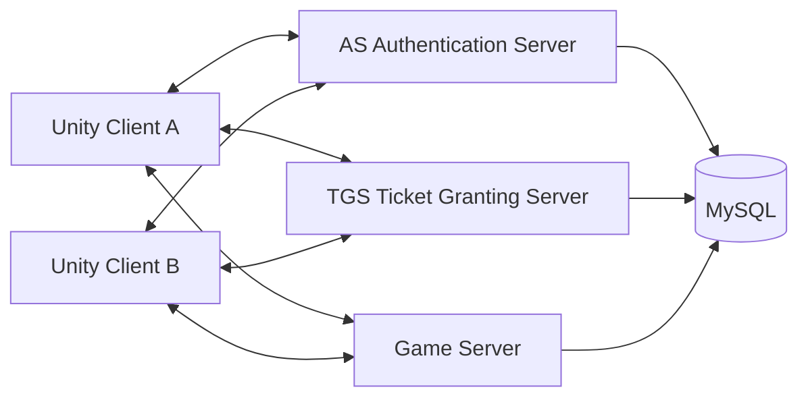
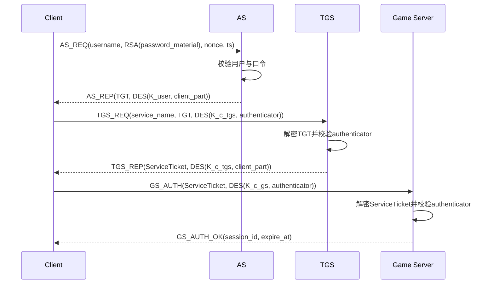
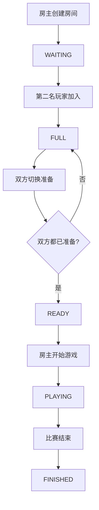
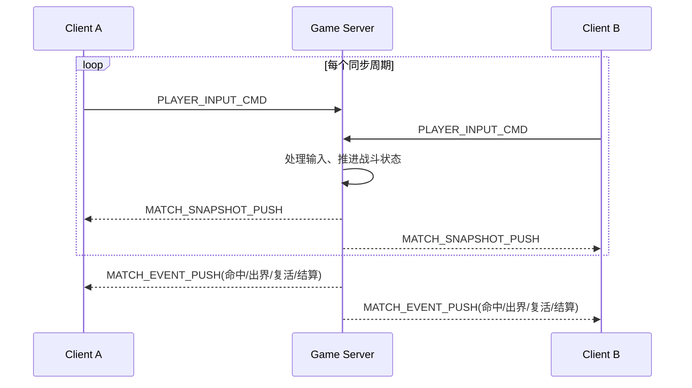

# 基于 Kerberos 的双人对战游戏 C/S 系统课程设计详细设计文档

## 封面信息

| 项目 | 内容 |
| --- | --- |
| 课程名称 | 网络安全课程设计 |
| 项目名称 | 基于 Kerberos 的双人对战游戏 C/S 系统 |
| 文档性质 | 课程设计详细设计文档 |
| 适用读者 | 课程老师、项目成员、后续实现人员 |
| 小组成员 | 待填写 |
| 指导教师 | 待填写 |
| 完成日期 | 待填写 |

## 1. 项目概述

### 1.1 课题背景

本课程设计的目标是在一个双人对战游戏场景中引入 Kerberos 认证机制，构建一个兼顾安全性与实时性的 C/S 系统。与传统只在应用层做用户名密码校验的做法不同，本方案将认证服务器、票据授权服务器和业务服务器分离，模拟经典 Kerberos 的完整工作链路，使系统既能满足网络安全课程对认证协议实现的要求，也能满足联机对战游戏对实时同步和服务端裁决的要求。

当前仓库已经包含 Unity 客户端代码，具备角色控制、武器攻击、伤害百分比、命数与复活等游戏逻辑，同时已经有一个演示级 WebSocket 客户端用于中转消息测试。因此，本设计文档不是从零抽象一个虚构项目，而是基于现有代码状态提出一个可落地的完整设计方案，使后续实现工作能够直接展开。

### 1.2 项目目标

本项目的核心目标如下：

1. 在游戏系统中完整实现 Kerberos 四角色认证链路，即 `Client`、`AS`、`TGS`、`Game Server`。
2. 使用 `Python` 实现服务端，使用 `MySQL` 进行持久化存储，使用 `WebSocket` 作为通信协议。
3. 实现一个双人房间制对战流程，支持创建房间、加入房间、准备、开始游戏、战斗同步和结算。
4. 由服务端维护权威战斗状态，客户端只上传输入，客户端界面以服务端同步结果为准。
5. 在安全设计上满足课程要求：不明文存储密码、引入票据、使用 DES 和 RSA、具备时间戳和防重放机制。
6. 产出一份能够直接指导编码实现的详细设计文档。

### 1.3 设计范围

本次课程设计的设计范围覆盖整个系统，而不仅限于某一个模块，包括：

- Unity 客户端的认证接入与联机改造方案；
- Kerberos 中 AS、TGS、Game Server 的职责与交互流程；
- 房间系统与对战同步机制；
- MySQL 库表设计；
- WebSocket 消息协议设计；
- 关键安全策略；
- 测试与验收设计。

本次设计默认不包含以下扩展功能：

- 复杂自动匹配系统；
- 断线重连恢复控制；
- 多地图资源热加载；
- 排行榜、赛季系统、支付系统等与课程设计目标无关的扩展业务。

### 1.4 技术栈总览

| 层次 | 技术 |
| --- | --- |
| 客户端 | Unity + C# |
| 服务端 | Python |
| 通信协议 | WebSocket |
| 数据库 | MySQL |
| 对称加密 | DES |
| 非对称加密 | RSA |
| 密码存储 | Salt + PBKDF2-HMAC-SHA256 |
| 架构模式 | C/S，多进程服务端，服务端权威同步 |

### 1.5 采用 C/S + Kerberos + WebSocket + MySQL 的原因

1. `C/S 架构` 适合实时游戏场景。客户端专注于输入采集和画面表现，服务端负责统一裁决与广播，能够降低作弊风险并减少状态分叉。
2. `Kerberos` 适合作为课程设计的安全认证主线。它通过票据和共享密钥机制，避免每次业务请求都发送口令，具有较强的教学价值和协议完整性。
3. `WebSocket` 适合双向实时通信。与纯 HTTP 相比，WebSocket 更适合房间同步和游戏状态广播。
4. `MySQL` 适合持久化用户、房间、对局结果和日志等结构化数据，便于演示规范化数据库设计。
5. `Python` 便于快速实现多进程服务端、WebSocket 服务、加密逻辑和数据库操作，适合作为课程设计技术选型。

## 2. 需求分析

### 2.1 功能需求

系统需要满足以下功能需求：

1. 用户可以注册并登录系统。
2. 用户登录后，通过 Kerberos 获取访问游戏服务的票据。
3. 用户可以创建房间或加入已有房间。
4. 房间最多容纳两名玩家。
5. 玩家可以在大厅中切换准备状态。
6. 房主在两人都准备后可以开始对战。
7. 对战过程中客户端只上传输入，服务端负责计算位置、攻击、伤害、出界、命数与复活。
8. 服务端向双方客户端广播权威状态和关键事件。
9. 对战结束后记录比赛结果。
10. 服务端能够记录认证与连接日志。

### 2.2 安全需求

系统必须满足以下安全需求：

1. 用户密码不能明文存储。
2. 登录后不能在后续业务通信中重复发送明文口令。
3. 必须存在 TGT 和 Service Ticket 两类票据。
4. 业务服务器需要校验用户是否持有合法票据。
5. 票据必须有有效期。
6. 必须使用时间戳和随机数防止重放攻击。
7. 服务端必须能识别伪造票据和篡改消息。
8. 会话密钥不能明文持久化到数据库。

### 2.3 性能与可维护性需求

1. 系统需要支持双人实时对战，服务端应以固定 Tick 处理输入和同步。
2. 运行态战斗状态应保存在内存中，不应每帧写数据库。
3. 模块边界要清晰，方便三人并行开发。
4. 协议应结构化，避免继续使用字符串拼接消息。
5. 设计应允许后续扩展为更多房间和更多 Game Server 实例。

### 2.4 使用场景

系统主要包含以下典型场景：

- 用户注册并登录；
- 用户经过 Kerberos 获取访问游戏服务器的授权；
- 用户创建或加入双人房间；
- 双方准备并进入对战；
- 对战过程中同步移动、跳跃、冲刺、攻击和命中结果；
- 玩家出界扣命并复活；
- 一方命数归零，比赛结束；
- 某一玩家中途断线，系统继续按“空输入”规则推进对战。

### 2.5 约束条件

1. 课程要求实现完整 Kerberos 四角色，不允许把 AS、TGS、Game Server 合并为一个逻辑角色。
2. 服务端语言固定为 Python，数据库固定为 MySQL，通信固定为 WebSocket。
3. 对称加密要求使用 DES，非对称加密使用 RSA。
4. 客户端已有 Unity 代码是系统起点，设计必须与现有仓库兼容。
5. 对战采用服务端权威模式，而非纯客户端互发状态模式。

## 3. 现有仓库分析

### 3.1 仓库结构概览

当前仓库根目录较简单，主要包含：

- `client/`：Unity 客户端脚本目录；
- `README.md`：仓库说明，内容很少；
- `.gitignore`：Unity 项目常规忽略规则。

目前仓库中不存在：

- Python 服务端代码；
- MySQL DDL 文件；
- 认证协议文档；
- 游戏通信协议文档；
- 课程设计正式设计文档。

### 3.2 当前客户端已实现的内容

结合现有代码，客户端已经具备以下能力：

1. **本地角色控制能力**  
   `client/Scripts/Player/Player.cs` 负责移动输入、交互、武器装备与部分状态逻辑。

2. **本地状态机驱动战斗**  
   `client/Scripts/Player/PlayerStates/` 下实现了移动、跳跃、空中状态、冲刺、基础攻击等状态。

3. **本地伤害与击飞机制**  
   `client/Scripts/Entity/Entity_Health.cs` 使用伤害百分比、击飞、命数与复活机制，风格类似平台对战游戏。

4. **本地 GameManager 维护命数与结算**  
   `client/Scripts/GameManager.cs` 中默认 `maxStocks = 3`，已经有扣命与结束判定逻辑。

5. **演示级 WebSocket 客户端**  
   `client/Scripts/RelayChatClient.cs` 和 `client/Scripts/GBManager/RelayChatClient.cs` 中存在两个内容相同的演示级客户端，可发送 `JOIN_ROOM`、`CHAT`、`LEAVE_ROOM`，接收 `SERVER_BROADCAST` 和 `ERROR`。

6. **大厅 UI 预留**  
   `client/Scripts/GBManager/LobbyManager.cs` 中已提供准备按钮、开始按钮和接收对方准备状态的占位接口。

### 3.3 当前联机能力的局限

现有仓库虽然已经有 WebSocket 连接代码，但仍处于演示阶段，主要局限如下：

1. 当前 WebSocket 消息格式只适合演示文字转发，不适合正式业务通信。
2. 当前没有注册、登录、票据申请、密钥协商等认证流程。
3. 当前没有服务端代码，所有大厅和对战流程都没有正式服务器支撑。
4. 当前没有数据库，因此用户、房间、对局记录、认证日志均无法持久化。
5. 当前战斗逻辑主要在客户端本地完成，不符合服务端权威同步要求。
6. 当前大厅“开始游戏”逻辑是本地直接切场景，并未经过服务器确认。

### 3.4 当前现状与目标方案的差距

| 方面 | 当前现状 | 目标方案 |
| --- | --- | --- |
| 认证 | 无正式认证 | 完整 Kerberos 四角色认证 |
| 服务端 | 不存在 | Python 多进程服务端 |
| 数据库 | 不存在 | MySQL 持久化 |
| 协议 | 演示级字符串消息 | 结构化业务协议 |
| 房间流程 | 客户端本地 UI 占位 | 服务端管理房间状态 |
| 对战裁决 | 客户端本地裁决 | 服务端权威裁决 |
| 断线策略 | 未定义 | 空输入继续模拟 |
| 日志审计 | 无 | 登录、会话、比赛日志 |

### 3.5 为什么必须引入结构化协议与服务端权威

如果继续沿用当前客户端本地裁决模式，会存在以下问题：

1. 两个客户端各自计算伤害和击飞，结果可能不一致。
2. 任何一方都可能伪造攻击结果，服务端无法校验。
3. 字符串消息无法承载认证票据、会话密钥、时序号和完整性校验字段。
4. 断线、重放、重复发送等异常场景无法被统一处理。

因此，本课程设计必须引入：

- 结构化协议；
- 服务端权威状态；
- Kerberos 票据认证；
- 数据库存储与日志能力。

## 4. 系统总体设计

### 4.1 总体架构说明

系统采用典型 C/S 架构。客户端负责采集输入和展示画面，认证服务负责身份验证，票据服务负责发放服务票据，游戏服务负责房间管理和战斗裁决，数据库负责持久化存储。



### 4.2 多进程划分

系统中的服务端划分为三个独立进程：

1. `AS`：处理注册、登录和 TGT 签发；
2. `TGS`：处理服务票据申请；
3. `Game Server`：处理业务会话、房间、对战和广播。

每个进程独立监听自己的 WebSocket 端口，进程之间通过共享配置和 MySQL 协调。出于课程设计复杂度控制，本方案不额外引入 Redis、消息队列和服务发现系统。

### 4.3 模块职责划分

| 模块 | 核心职责 |
| --- | --- |
| Client | 发起认证、上传输入、接收同步、更新界面 |
| AS | 验证身份、签发 TGT、生成 `K_c_tgs` |
| TGS | 校验 TGT、签发 Service Ticket、生成 `K_c_gs` |
| Game Server | 校验服务票据、维护会话、管理房间、权威模拟对战、广播结果 |
| MySQL | 保存用户、房间、对局、会话日志和认证日志 |

### 4.4 部署关系

建议开发与课程答辩演示时采用单机部署：

- `AS`：`ws://127.0.0.1:9001/ws/as`
- `TGS`：`ws://127.0.0.1:9002/ws/tgs`
- `Game Server`：`ws://127.0.0.1:9100/ws/game`
- `MySQL`：`127.0.0.1:3306`

部署上虽然在同一台机器中运行，但逻辑上仍保持进程隔离，以符合 Kerberos 四角色的课程要求。

### 4.5 数据流总览

1. 用户在客户端输入账号口令；
2. Client 与 AS 交互，获取 `TGT` 和 `K_c_tgs`；
3. Client 持 `TGT` 与 TGS 交互，获取 `Service Ticket` 和 `K_c_gs`；
4. Client 持 `Service Ticket` 与 Game Server 建立业务会话；
5. Client 进入房间系统，接收房间状态；
6. 开局后，Client 周期性上报输入；
7. Game Server 固定 Tick 处理输入与战斗逻辑；
8. Game Server 向双方广播快照和关键事件；
9. 对局结束后，结果落库。

## 5. Kerberos 认证设计

### 5.1 认证参与方说明

本系统中的 Kerberos 认证涉及四类参与方：

1. **Client**  
   游戏客户端，请求用户认证、服务票据和业务连接。

2. **AS（Authentication Server）**  
   负责校验用户身份并签发 TGT。

3. **TGS（Ticket Granting Server）**  
   负责在用户已经持有 TGT 的情况下，为目标服务签发 Service Ticket。

4. **Game Server**  
   负责校验 Service Ticket 并建立实际游戏业务会话。

### 5.2 密钥定义

为保证后续实现时不再产生歧义，本设计对密钥含义固定如下：

| 密钥名 | 含义 | 持有方 | 生命周期 |
| --- | --- | --- | --- |
| `K_user` | 用户口令派生密钥 | Client、AS 临时计算 | 登录阶段 |
| `K_tgs` | TGS 长期密钥 | AS、TGS | 长期 |
| `K_gs` | Game Server 长期密钥 | TGS、Game Server | 长期 |
| `K_c_tgs` | Client 与 TGS 的会话密钥 | Client、TGS | TGT 有效期内 |
| `K_c_gs` | Client 与 Game Server 的会话密钥 | Client、Game Server | Service Ticket 有效期内 |

### 5.3 密码与密钥派生原则

1. 用户注册时不保存明文密码。
2. 数据库保存 `salt` 和 `PBKDF2-HMAC-SHA256(password, salt, iterations)` 的结果。
3. 用户登录时，客户端根据输入口令结合本地规则派生 `K_user`，用于解密 AS 返回给客户端的密钥材料。
4. AS 侧不保存 `K_user`，只在登录校验阶段根据密码哈希比对结果决定是否签发 TGT。

### 5.4 RSA 与 DES 的职责分工

为了满足题目要求并兼顾协议合理性，本项目对两种加密算法职责约定如下：

| 算法 | 职责 |
| --- | --- |
| RSA | 初始敏感请求保护、服务公钥身份体系、少量敏感字段封装 |
| DES | 票据加密、认证材料加密、后续业务消息会话加密 |

说明：

1. Kerberos 的核心思想是基于对称密钥进行票据认证，因此 DES 在本方案中承担主要会话与票据加密职责。
2. 为满足课程对非对称加密的使用要求，Client 向 AS 发起初始认证时，可使用 AS 公钥对敏感数据进行 RSA 加密。
3. TGT 和 Service Ticket 均使用 DES 加密，分别由 `K_tgs` 和 `K_gs` 保护。

### 5.5 票据定义

#### 5.5.1 TGT

TGT 由 AS 发给 Client，实际上是“供 TGS 解密的票据”，其明文结构定义如下：

```json
{
  "user_id": 10001,
  "username": "player_a",
  "k_c_tgs": "Base64(DES session key)",
  "issued_at": "2026-04-20T10:00:00Z",
  "expire_at": "2026-04-20T12:00:00Z",
  "client_ip": "127.0.0.1"
}
```

TGT 使用 `K_tgs` 进行 DES 加密，Client 只能转发，不能解出其中明文。

#### 5.5.2 Service Ticket

Service Ticket 由 TGS 发给 Client，实际上是“供 Game Server 解密的票据”，其明文结构定义如下：

```json
{
  "user_id": 10001,
  "username": "player_a",
  "service_name": "game-server-1",
  "k_c_gs": "Base64(DES session key)",
  "issued_at": "2026-04-20T10:05:00Z",
  "expire_at": "2026-04-20T11:05:00Z"
}
```

Service Ticket 使用 `K_gs` 进行 DES 加密。

### 5.6 Kerberos 完整认证步骤

#### 5.6.1 步骤 1：Client 向 AS 请求认证

消息名称：`AS_REQ`

发送方向：`Client -> AS`

核心内容：

- 用户名；
- 使用 AS 公钥加密后的口令材料；
- nonce；
- timestamp；

AS 校验内容：

- 用户是否存在；
- 口令是否正确；
- 账户是否被禁用；
- timestamp 是否在允许窗口内。

#### 5.6.2 步骤 2：AS 返回 TGT 与 `K_c_tgs`

消息名称：`AS_REP`

发送方向：`AS -> Client`

返回内容分为两部分：

1. `tgt`：使用 `K_tgs` 加密的票据；
2. `client_part`：使用 `K_user` 加密的返回数据，包含：
   - `k_c_tgs`
   - `tgs_id`
   - `issued_at`
   - `expire_at`
   - `nonce`

Client 收到后：

1. 使用自身派生的 `K_user` 解密 `client_part`；
2. 保存 `k_c_tgs`；
3. 缓存 `tgt` 以便下一阶段请求 TGS。

#### 5.6.3 步骤 3：Client 向 TGS 申请访问 Game Server 的票据

消息名称：`TGS_REQ`

发送方向：`Client -> TGS`

发送内容：

- `service_name`
- `tgt`
- `authenticator`

其中：

- `tgt` 原样转发；
- `authenticator` 使用 `K_c_tgs` 做 DES 加密，内容包含：
  - `user_id`
  - `timestamp_ms`
  - `nonce`

TGS 校验内容：

1. 解密 `tgt`，确认合法性和有效期；
2. 取出其中的 `k_c_tgs`；
3. 使用 `k_c_tgs` 解密 `authenticator`；
4. 校验 user_id 是否一致；
5. 校验 timestamp 是否超时；
6. 校验 nonce 是否已被使用过；
7. 校验请求的 `service_name` 是否存在。

#### 5.6.4 步骤 4：TGS 返回 Service Ticket 与 `K_c_gs`

消息名称：`TGS_REP`

发送方向：`TGS -> Client`

返回内容分为两部分：

1. `service_ticket`：使用 `K_gs` 加密的票据；
2. `client_part`：使用 `K_c_tgs` 加密的数据，包含：
   - `k_c_gs`
   - `service_name`
   - `issued_at`
   - `expire_at`
   - `nonce`

Client 收到后：

1. 使用 `K_c_tgs` 解密 `client_part`；
2. 获取 `k_c_gs`；
3. 保存 `service_ticket`。

#### 5.6.5 步骤 5：Client 持 Service Ticket 连接 Game Server

消息名称：`GS_AUTH`

发送方向：`Client -> Game Server`

发送内容：

- `service_ticket`
- `authenticator`

其中 `authenticator` 使用 `K_c_gs` 做 DES 加密，内容包含：

- `user_id`
- `timestamp_ms`
- `nonce`

Game Server 校验内容：

1. 使用 `K_gs` 解密 `service_ticket`；
2. 获取票据中的 `k_c_gs`、用户身份和有效期；
3. 使用 `k_c_gs` 解密 `authenticator`；
4. 校验 user_id；
5. 校验 timestamp；
6. 校验 nonce 是否重复；
7. 创建业务会话。

#### 5.6.6 步骤 6：Game Server 返回业务会话确认

消息名称：`GS_AUTH_OK`

发送方向：`Game Server -> Client`

返回内容：

- `session_id`
- `user_id`
- `username`
- `server_time_ms`
- `expire_at`

至此，Client 正式进入房间和对战业务阶段。

### 5.7 Kerberos 认证时序图



### 5.8 防重放设计

本系统防重放设计必须同时使用以下机制：

1. **timestamp**  
   所有认证请求都带时间戳。服务端只接受与本机时间相差不超过设定窗口的请求，例如 30 秒。

2. **nonce**  
   每次认证请求都带唯一随机数。服务端在短时间内缓存已使用过的 nonce，若同一用户再次提交相同 nonce，则直接拒绝。

3. **ticket expire_at**  
   TGT 和 Service Ticket 均有明确过期时间，到期后不可再使用。

4. **authenticator 一次性校验**  
   即使同一个 Service Ticket 在有效期内，`authenticator` 也必须使用新的 timestamp 和 nonce，不能简单重放旧包。

### 5.9 失效与异常处理策略

| 场景 | 处理方式 |
| --- | --- |
| 用户不存在 | 返回认证失败 |
| 密码错误 | 返回认证失败并记录日志 |
| 用户被禁用 | 返回认证失败 |
| TGT 过期 | 拒绝 TGS 请求，要求重新登录 |
| Service Ticket 过期 | 拒绝进入 Game Server，要求重新申请票据 |
| 非法票据 | 拒绝请求并记录异常日志 |
| authenticator 重放 | 拒绝请求并记录安全事件 |
| 服务不存在 | TGS 返回错误 |

## 6. 游戏联机与对战设计

### 6.1 房间系统设计目标

房间系统用于承接完成认证后的业务入口，负责组织双人对战前的准备流程。一个房间最多容纳两名玩家，由房主创建，双方完成准备后才能开始对局。

### 6.2 房间状态定义

房间状态固定如下：

| 状态 | 含义 | 进入条件 | 退出条件 | 允许操作 |
| --- | --- | --- | --- | --- |
| `WAITING` | 等待玩家加入 | 房间创建完成 | 第二名玩家加入 | 房主等待、玩家加入、玩家离开 |
| `FULL` | 房间已满但未全员准备 | 已有两名玩家 | 双方都准备或有人离开 | 准备、取消准备、离开 |
| `READY` | 双方已准备，可开始 | 两名玩家都 ready | 房主点击开始、有人取消准备、有人离开 | 开始游戏、取消准备、离开 |
| `PLAYING` | 对局进行中 | Game Server 确认开局 | 比赛结束 | 输入上传、状态广播 |
| `FINISHED` | 比赛已结束 | 有胜负结果 | 房间关闭或重置 | 查看结果、离开 |
| `CLOSED` | 房间关闭 | 房主关闭或系统清理 | 无 | 无 |

### 6.3 房间成员字段定义

每个房间成员需要维护以下关键字段：

| 字段 | 含义 |
| --- | --- |
| `user_id` | 用户唯一标识 |
| `username` | 用户名 |
| `slot_no` | 槽位号，固定为 1 或 2 |
| `is_ready` | 是否准备 |
| `is_online` | 是否在线 |
| `joined_at` | 加入时间 |

### 6.4 房间流程说明

1. 玩家 A 创建房间，成为房主，占用 `slot_no = 1`。
2. 玩家 B 通过房间号加入，进入 `slot_no = 2`。
3. 双方分别切换准备状态。
4. 当两名玩家都准备完毕，房间状态变为 `READY`。
5. 房主点击开始后，Game Server 创建对局实例并切换到 `PLAYING`。
6. 对局结束后，房间状态变为 `FINISHED`。

### 6.5 房间流程图



### 6.6 服务端权威同步模型

本设计采用“输入上行、状态下行”的权威同步模型，其核心思想是：

1. 客户端不直接告诉服务器“我造成了多少伤害”；
2. 客户端只上报输入，如移动方向、跳跃、攻击、瞄准；
3. 服务端根据统一逻辑和统一时间推进角色状态；
4. 服务端计算命中、伤害、击飞、出界、复活和比赛结束；
5. 客户端根据服务器广播结果更新自身画面与 UI。

选择该模型的原因：

- 现有仓库中伤害和击飞逻辑都在客户端本地，若直接联机将导致结果不一致；
- 服务端权威可以明显降低作弊和同步分歧；
- 该模式更适合课程设计中展示安全和协议完整性。

### 6.7 客户端上传的输入数据

客户端需要上传的输入字段如下：

| 字段 | 含义 |
| --- | --- |
| `move_x` | 横向移动输入 |
| `move_y` | 纵向输入 |
| `jump_pressed` | 本帧是否按下跳跃 |
| `dash_pressed` | 本帧是否按下冲刺 |
| `attack_pressed` | 本帧是否按下攻击 |
| `interact_pressed` | 本帧是否按下交互 |
| `aim_x` | 瞄准向量 X |
| `aim_y` | 瞄准向量 Y |
| `input_seq` | 输入序号 |
| `client_time_ms` | 客户端时间戳 |

### 6.8 服务端维护的权威状态

Game Server 在内存中维护以下运行态数据：

1. 玩家位置 `x, y`
2. 玩家速度 `vx, vy`
3. 玩家朝向 `facing_dir`
4. 玩家当前状态机状态，如 idle、move、jump、dash、attack
5. 当前武器和武器冷却
6. 子弹列表与子弹飞行状态
7. 伤害百分比
8. 剩余命数
9. 复活倒计时
10. 比赛阶段
11. 最近处理的输入序号

### 6.9 服务端广播的数据

服务端对客户端下发的数据分为两类：

1. **周期性快照**  
   用于持续校正双方看到的权威状态，如位置、百分比、命数、子弹。

2. **关键事件**  
   用于表现离散事件，如攻击触发、命中、出界、复活、倒计时开始、比赛结束。

### 6.10 战斗阶段定义

| 阶段 | 含义 |
| --- | --- |
| `COUNTDOWN` | 开局倒计时阶段 |
| `PLAYING` | 正式战斗阶段 |
| `RESPAWNING` | 某玩家正在等待复活 |
| `RESULT` | 对局结束阶段 |

### 6.11 断线处理规则

本次课程设计中，断线处理规则固定如下，不再留给后续实现者自行决定：

1. 玩家断线后，不立即判负。
2. 对局不中断、不暂停、不回滚。
3. 断线玩家的后续输入按“空输入”处理：
   - `move_x = 0`
   - `move_y = 0`
   - `jump_pressed = false`
   - `dash_pressed = false`
   - `attack_pressed = false`
   - `interact_pressed = false`
4. 断线玩家角色继续保留在战场中。
5. 断线玩家仍然：
   - 可以被攻击；
   - 可以被击飞；
   - 可以出界；
   - 可以扣命；
   - 可以复活；
   - 可以参与正常结算。
6. 另一名玩家继续正常游戏。
7. 本次课程设计默认不支持断线重连恢复控制。

采用该规则的原因是：课程设计需要在有限时间内实现一个完整且可稳定演示的方案，而断线重连会引入会话恢复、状态回放、输入补发、控制权恢复等额外复杂性。将断线视为“空输入”能够保证对局继续推进，同时保留服务器权威的一致性。

### 6.12 对战同步流程图



## 7. 服务端详细设计

### 7.1 服务端总体模块

服务端建议按如下逻辑模块组织：

| 模块 | 核心职责 |
| --- | --- |
| `AS Server` | 处理注册、登录、TGT 签发 |
| `TGS Server` | 处理服务票据签发 |
| `Game Server` | 处理业务会话、房间和战斗 |
| `CryptoService` | 封装 RSA、DES、哈希、随机数、MAC |
| `TicketService` | 生成与校验 TGT、Service Ticket |
| `SessionManager` | 管理业务会话、会话过期、seq 和心跳 |
| `RoomManager` | 房间创建、加入、准备、离开、关闭 |
| `MatchManager` | 创建对局、切换比赛阶段、记录比赛结果 |
| `BattleSimulator` | 每 Tick 推进战斗、计算命中和状态变化 |
| `BroadcastService` | 广播快照、事件、错误消息 |
| `UserRepository` | 用户查询和更新 |
| `RoomRepository` | 房间与房间成员落库 |
| `MatchRepository` | 对局与事件落库 |

### 7.2 AS Server 设计

#### 职责

- 处理用户注册；
- 处理用户登录；
- 生成 `K_c_tgs`；
- 使用 `K_tgs` 生成 TGT；
- 返回给客户端可解密的 `client_part`。

#### 输入

- `REGISTER_REQ`
- `AS_REQ`

#### 输出

- `REGISTER_RESP`
- `AS_REP`

#### 内部核心数据

- 用户基础信息；
- 用户密码哈希；
- TGS 服务配置；
- 登录日志。

#### 调用关系

- 调用 `UserRepository` 查询用户；
- 调用 `CryptoService` 完成密码验证与加密；
- 调用 `TicketService` 生成 TGT；
- 调用 `LoginAuditRepository` 记录日志。

### 7.3 TGS Server 设计

#### 职责

- 接收 Client 提交的 `TGT + Authenticator`；
- 解密并校验 TGT；
- 生成 `K_c_gs`；
- 为目标 Game Server 生成 Service Ticket。

#### 输入

- `TGS_REQ`

#### 输出

- `TGS_REP`

#### 内部核心数据

- TGS 长期密钥 `K_tgs`；
- 各 Game Server 的长期密钥 `K_gs`；
- 短期 nonce 去重缓存。

#### 调用关系

- 调用 `TicketService` 解密 TGT；
- 调用 `CryptoService` 解密 authenticator；
- 调用 `ServiceNodeRepository` 查询目标服务；
- 调用 `TicketService` 生成 Service Ticket。

### 7.4 Game Server 设计

#### 职责

- 校验 Service Ticket；
- 建立业务会话；
- 管理房间；
- 驱动战斗模拟；
- 广播快照和事件；
- 记录比赛结果。

#### 输入

- `GS_AUTH`
- 房间类消息；
- 对战输入消息；
- 心跳消息。

#### 输出

- `GS_AUTH_OK`
- `ROOM_STATE_PUSH`
- `MATCH_COUNTDOWN_PUSH`
- `MATCH_SNAPSHOT_PUSH`
- `MATCH_EVENT_PUSH`
- `MATCH_RESULT_PUSH`
- `ERROR_PUSH`

#### 内部核心数据

- 在线用户会话表；
- 房间表；
- 正在运行的对局实例；
- 每个玩家最近输入；
- 每局比赛的当前帧号。

#### 调用关系

- 调用 `SessionManager` 管理连接；
- 调用 `RoomManager` 管理房间；
- 调用 `MatchManager` 创建和结束比赛；
- 调用 `BattleSimulator` 进行每 Tick 模拟；
- 调用 `BroadcastService` 下发消息；
- 调用 `MatchRepository` 落库。

### 7.5 CryptoService 设计

#### 职责

- RSA 加解密；
- DES 加解密；
- PBKDF2 派生；
- MAC 生成与校验；
- nonce、会话密钥生成。

#### 输入

- 原始明文、密钥材料、IV、算法参数。

#### 输出

- 加密结果、解密结果、哈希结果、随机密钥。

#### 内部核心数据

- RSA 公私钥；
- DES Key 版本信息；
- PBKDF2 迭代次数配置。

### 7.6 TicketService 设计

#### 职责

- 构造 TGT；
- 构造 Service Ticket；
- 校验票据有效期；
- 解密并解析票据。

#### 输入

- 用户身份；
- 目标服务标识；
- 会话密钥；
- 长期密钥；
- 时间参数。

#### 输出

- `tgt`
- `service_ticket`
- 票据解密后的业务对象。

### 7.7 SessionManager 设计

#### 职责

- 为成功鉴权用户创建 `session_id`；
- 维护用户与 WebSocket 连接映射；
- 校验 `seq` 是否递增；
- 维护心跳时间；
- 管理会话过期与关闭。

#### 输入

- 鉴权成功事件；
- 客户端心跳；
- 断线事件。

#### 输出

- 会话对象；
- 断线标记；
- 心跳异常告警。

### 7.8 RoomManager 设计

#### 职责

- 创建房间；
- 分配房间号；
- 加入与离开房间；
- 维护 ready 状态；
- 在适当时机通知 MatchManager 开始游戏。

#### 输入

- `ROOM_CREATE_REQ`
- `ROOM_JOIN_REQ`
- `ROOM_LEAVE_REQ`
- `ROOM_READY_REQ`
- `MATCH_START_REQ`

#### 输出

- 房间最新状态；
- 房间状态广播。

### 7.9 MatchManager 设计

#### 职责

- 从房间创建对局实例；
- 初始化双方命数；
- 维护比赛阶段；
- 接收 BattleSimulator 的结束结果；
- 触发比赛落库。

#### 输入

- 房间准备完成事件；
- 房主开始事件；
- 玩家输入；
- BattleSimulator 回调。

#### 输出

- 倒计时广播；
- 对局结束结果；
- 对局记录。

### 7.10 BattleSimulator 设计

#### 职责

- 固定 Tick 推进角色与子弹状态；
- 处理移动、跳跃、冲刺、攻击；
- 判定近战命中和远程命中；
- 处理伤害百分比与击飞；
- 处理出界扣命与复活；
- 处理断线玩家空输入。

#### 输入

- 当前对局状态；
- 每名玩家最近输入；
- 地图边界参数；
- 武器与角色基础参数。

#### 输出

- 新的权威状态快照；
- 离散事件列表；
- 比赛结束标志。

### 7.11 BroadcastService 设计

#### 职责

- 向房间内玩家广播统一格式消息；
- 广播周期性快照；
- 广播关键事件；
- 广播错误信息。

#### 输入

- 房间状态变化；
- 对局状态变化；
- BattleSimulator 输出；
- 错误对象。

#### 输出

- WebSocket 消息包。

### 7.12 Repository 设计

#### UserRepository

- 查询用户；
- 创建用户；
- 更新最后登录时间和 IP；
- 更新状态。

#### RoomRepository

- 创建房间记录；
- 插入房间成员记录；
- 更新准备状态；
- 更新房间状态；
- 记录离开时间。

#### MatchRepository

- 创建对局记录；
- 记录比赛事件；
- 保存最终结果；
- 查询历史比赛。

## 8. 客户端详细设计

### 8.1 客户端职责重新定义

在目标方案中，客户端职责不再是“本地完成全部逻辑并偶尔发消息”，而是：

1. 负责采集用户输入；
2. 负责发起 Kerberos 认证；
3. 负责缓存票据和会话密钥；
4. 负责上传结构化输入消息；
5. 负责接收房间和战斗状态；
6. 负责根据服务端结果更新本地表现；
7. 负责界面展示而不是最终裁决。

### 8.2 认证流程接入点

建议将当前 `RelayChatClient` 的职责升级为真正的网络入口控制器，分阶段管理：

1. 连接 AS；
2. 完成注册或登录；
3. 获取 TGT；
4. 连接 TGS 申请 Service Ticket；
5. 连接 Game Server 完成 `GS_AUTH`；
6. 切换到大厅业务状态。

### 8.3 房间流程接入点

当前 `LobbyManager` 已有 ready 和 start 按钮逻辑，但其网络接口仍为 TODO。目标改造如下：

| 当前脚本 | 现状 | 目标接入方式 |
| --- | --- | --- |
| `LobbyManager.cs` | 本地 ready/start 占位 | 接入 `ROOM_READY_REQ`、`MATCH_START_REQ`、`ROOM_STATE_PUSH` |
| `MainMenuManager.cs` | 本地切换大厅 UI | 保留 UI 切换，但进入房间和开局依赖服务端回包 |
| `RelayChatClient.cs` | 演示级房间聊天客户端 | 升级为结构化业务连接层 |

### 8.4 战斗输入上报

客户端应从现有输入系统中提取可同步的业务输入，而不是同步本地结算结果。主要来源如下：

- `Player.cs` 的移动与交互输入；
- `Player_GroundedState.cs`、`Player_AirState.cs` 中的跳跃、攻击触发；
- `Player_DashState.cs` 中的冲刺输入；
- 鼠标瞄准方向。

目标做法：

1. 每个同步周期打包当前输入状态；
2. 发送给 Game Server；
3. 客户端本地可以做轻量表现预测；
4. 最终状态以 `MATCH_SNAPSHOT_PUSH` 为准。

### 8.5 状态同步接收

客户端需要接收的核心业务消息如下：

1. `ROOM_STATE_PUSH`：刷新大厅 UI；
2. `MATCH_COUNTDOWN_PUSH`：显示开局倒计时并切换到战斗场景；
3. `MATCH_SNAPSHOT_PUSH`：更新玩家位置、百分比、命数、子弹、比赛阶段；
4. `MATCH_EVENT_PUSH`：播放攻击、命中、出界、复活等表现；
5. `MATCH_RESULT_PUSH`：弹出结果界面；
6. `ERROR_PUSH`：显示错误提示。

### 8.6 本地预测与表现层职责

客户端可以保留少量本地表现控制，但必须明确边界：

允许客户端本地做的事情：

- 播放按钮反馈；
- 播放特效和动画；
- 暂时预测角色表现；
- 根据服务端事件刷新 UI。

不允许客户端最终决定的事情：

- 是否命中；
- 造成多少伤害；
- 是否出界扣命；
- 是否复活；
- 比赛是否结束。

### 8.7 与现有 Unity 脚本的衔接方式

| 脚本/模块 | 当前作用 | 目标作用 |
| --- | --- | --- |
| `RelayChatClient.cs` | 测试 WebSocket 聊天 | 正式网络连接与消息分发 |
| `LobbyManager.cs` | 本地大厅 UI | 作为房间状态展示层 |
| `GameManager.cs` | 本地命数和结算管理 | 部分逻辑迁移为仅响应服务端结果 |
| `Entity_Health.cs` | 本地伤害与命数处理 | 逐步调整为接收权威结果后更新表现 |
| `Player.cs` 和状态机 | 本地控制角色 | 输出输入指令和接收同步校正 |

## 9. 数据库设计

### 9.1 数据库设计原则

本系统中的数据库只负责持久化以下数据：

- 用户信息；
- 服务节点信息；
- 房间元数据；
- 房间成员关系；
- 对局记录；
- 比赛事件日志；
- 登录审计；
- WebSocket 会话日志。

以下数据不直接持久化到数据库，而只保存在内存：

- 实时玩家位置；
- 每 Tick 输入；
- 子弹实时坐标；
- 当前帧击飞速度；
- 即时碰撞检测结果。

原因是这些运行态数据频率高、变化快，若逐帧落库会引入巨大开销且无必要。

### 9.2 数据库关系说明

数据库关系可以概括为：

- 一个用户可以创建多个房间；
- 一个房间包含两个房间成员记录；
- 一个房间可以对应零个或一个比赛实例；
- 一个比赛实例可以对应多条比赛事件；
- 一个用户可以有多条登录审计和会话记录。

### 9.3 核心表结构

#### 9.3.1 `users`

| 字段名 | 类型 | 主键 | 可空 | 含义 | 备注 |
| --- | --- | --- | --- | --- | --- |
| `id` | BIGINT | 是 | 否 | 用户主键 | 自增 |
| `username` | VARCHAR(32) | 否 | 否 | 用户名 | 唯一 |
| `nickname` | VARCHAR(32) | 否 | 是 | 昵称 | 可用于界面展示 |
| `password_salt` | VARBINARY(16) | 否 | 否 | 密码盐值 | 不明文存储 |
| `password_hash` | VARBINARY(32) | 否 | 否 | 密码哈希 | PBKDF2 结果 |
| `status` | TINYINT | 否 | 否 | 用户状态 | 1 正常，0 禁用 |
| `created_at` | DATETIME | 否 | 否 | 创建时间 |  |
| `updated_at` | DATETIME | 否 | 否 | 更新时间 |  |
| `last_login_at` | DATETIME | 否 | 是 | 最后登录时间 |  |
| `last_login_ip` | VARCHAR(45) | 否 | 是 | 最后登录 IP | IPv4/IPv6 |

#### 9.3.2 `service_nodes`

| 字段名 | 类型 | 主键 | 可空 | 含义 | 备注 |
| --- | --- | --- | --- | --- | --- |
| `id` | BIGINT | 是 | 否 | 服务节点主键 | 自增 |
| `service_name` | VARCHAR(64) | 否 | 否 | 服务名 | 唯一 |
| `service_type` | ENUM('TGS','GAME') | 否 | 否 | 服务类型 |  |
| `host` | VARCHAR(64) | 否 | 否 | 主机地址 |  |
| `port` | INT | 否 | 否 | 端口 |  |
| `ws_path` | VARCHAR(64) | 否 | 否 | WebSocket 路径 |  |
| `rsa_public_key_pem` | TEXT | 否 | 是 | 服务公钥 | 可选 |
| `des_key_version` | INT | 否 | 否 | DES key 版本 |  |
| `is_active` | TINYINT | 否 | 否 | 是否启用 |  |
| `updated_at` | DATETIME | 否 | 否 | 更新时间 |  |

#### 9.3.3 `rooms`

| 字段名 | 类型 | 主键 | 可空 | 含义 | 备注 |
| --- | --- | --- | --- | --- | --- |
| `id` | BIGINT | 是 | 否 | 房间主键 | 自增 |
| `room_id` | CHAR(36) | 否 | 否 | 房间 UUID | 唯一 |
| `room_code` | VARCHAR(12) | 否 | 否 | 房间号 | 唯一，便于输入 |
| `owner_user_id` | BIGINT | 否 | 否 | 房主用户 ID | 外键 |
| `status` | ENUM('WAITING','FULL','READY','PLAYING','FINISHED','CLOSED') | 否 | 否 | 房间状态 |  |
| `max_players` | TINYINT | 否 | 否 | 最大人数 | 固定 2 |
| `map_id` | VARCHAR(32) | 否 | 是 | 地图编号 |  |
| `created_at` | DATETIME | 否 | 否 | 创建时间 |  |
| `started_at` | DATETIME | 否 | 是 | 开始时间 |  |
| `ended_at` | DATETIME | 否 | 是 | 结束时间 |  |

#### 9.3.4 `room_players`

| 字段名 | 类型 | 主键 | 可空 | 含义 | 备注 |
| --- | --- | --- | --- | --- | --- |
| `id` | BIGINT | 是 | 否 | 主键 | 自增 |
| `room_id` | BIGINT | 否 | 否 | 房间主键 | 外键 |
| `user_id` | BIGINT | 否 | 否 | 用户主键 | 外键 |
| `slot_no` | TINYINT | 否 | 否 | 槽位号 | 1 或 2 |
| `is_ready` | TINYINT | 否 | 否 | 是否准备 | 0/1 |
| `is_online` | TINYINT | 否 | 否 | 是否在线 | 0/1 |
| `joined_at` | DATETIME | 否 | 否 | 加入时间 |  |
| `left_at` | DATETIME | 否 | 是 | 离开时间 |  |

#### 9.3.5 `matches`

| 字段名 | 类型 | 主键 | 可空 | 含义 | 备注 |
| --- | --- | --- | --- | --- | --- |
| `id` | BIGINT | 是 | 否 | 对局主键 | 自增 |
| `match_id` | CHAR(36) | 否 | 否 | 对局 UUID | 唯一 |
| `room_id` | BIGINT | 否 | 否 | 来源房间 | 外键 |
| `player1_user_id` | BIGINT | 否 | 否 | 玩家 1 |  |
| `player2_user_id` | BIGINT | 否 | 否 | 玩家 2 |  |
| `winner_user_id` | BIGINT | 否 | 是 | 获胜者 | 可空 |
| `status` | ENUM('COUNTDOWN','PLAYING','FINISHED','ABORTED') | 否 | 否 | 对局状态 |  |
| `max_stocks` | TINYINT | 否 | 否 | 初始命数 | 默认 3 |
| `p1_stocks_left` | TINYINT | 否 | 否 | P1 剩余命数 |  |
| `p2_stocks_left` | TINYINT | 否 | 否 | P2 剩余命数 |  |
| `start_at` | DATETIME | 否 | 否 | 开始时间 |  |
| `end_at` | DATETIME | 否 | 是 | 结束时间 |  |
| `result_reason` | ENUM('KNOCKOUT','DISCONNECT_PASSIVE','TIMEOUT') | 否 | 是 | 结束原因 |  |
| `final_snapshot_json` | JSON | 否 | 是 | 最终快照 | 便于回看 |

#### 9.3.6 `match_events`

| 字段名 | 类型 | 主键 | 可空 | 含义 | 备注 |
| --- | --- | --- | --- | --- | --- |
| `id` | BIGINT | 是 | 否 | 主键 | 自增 |
| `match_id` | BIGINT | 否 | 否 | 对局 ID | 外键 |
| `seq` | BIGINT | 否 | 否 | 事件序号 | 房间内单调递增 |
| `frame_no` | INT | 否 | 否 | 服务端帧号 |  |
| `event_type` | VARCHAR(32) | 否 | 否 | 事件类型 |  |
| `actor_user_id` | BIGINT | 否 | 是 | 触发者 | 可空 |
| `payload_json` | JSON | 否 | 否 | 事件详情 |  |
| `created_at` | DATETIME | 否 | 否 | 记录时间 |  |

#### 9.3.7 `login_audit`

| 字段名 | 类型 | 主键 | 可空 | 含义 | 备注 |
| --- | --- | --- | --- | --- | --- |
| `id` | BIGINT | 是 | 否 | 主键 | 自增 |
| `user_id` | BIGINT | 否 | 是 | 用户 ID | 登录失败时可空 |
| `username` | VARCHAR(32) | 否 | 否 | 尝试登录的用户名 |  |
| `client_ip` | VARCHAR(45) | 否 | 否 | 客户端 IP |  |
| `success` | TINYINT | 否 | 否 | 是否成功 | 0/1 |
| `reason_code` | VARCHAR(32) | 否 | 否 | 原因码 | 如 `BAD_PASSWORD` |
| `created_at` | DATETIME | 否 | 否 | 时间 |  |

#### 9.3.8 `ws_sessions`

| 字段名 | 类型 | 主键 | 可空 | 含义 | 备注 |
| --- | --- | --- | --- | --- | --- |
| `id` | BIGINT | 是 | 否 | 主键 | 自增 |
| `session_id` | CHAR(36) | 否 | 否 | 会话 ID | 唯一 |
| `user_id` | BIGINT | 否 | 否 | 用户 ID | 外键 |
| `service_name` | VARCHAR(64) | 否 | 否 | 所属服务 |  |
| `room_id` | BIGINT | 否 | 是 | 所在房间 | 可空 |
| `connected_at` | DATETIME | 否 | 否 | 建立时间 |  |
| `disconnected_at` | DATETIME | 否 | 是 | 断开时间 |  |
| `ticket_expire_at` | DATETIME | 否 | 否 | 票据到期时间 |  |
| `last_seq` | BIGINT | 否 | 否 | 最近处理序号 | 默认 0 |
| `status` | ENUM('ONLINE','CLOSED') | 否 | 否 | 会话状态 |  |

### 9.4 主外键与唯一索引说明

1. `users.username` 唯一，避免重复注册。
2. `rooms.room_id` 和 `rooms.room_code` 唯一，分别用于系统内部标识和用户输入。
3. `room_players(room_id, user_id)` 唯一，避免同一用户重复进入同一房间。
4. `room_players(room_id, slot_no)` 唯一，保证房间槽位唯一。
5. `matches.match_id` 唯一。
6. `match_events(match_id, seq)` 建议建立联合索引，便于按序读取比赛事件。
7. `ws_sessions.session_id` 唯一。

### 9.5 常用查询场景

1. 按用户名查询用户登录信息；
2. 根据房间号查询房间和房间成员；
3. 根据用户 ID 查询当前房间；
4. 根据房间 ID 查询当前比赛；
5. 根据对局 ID 查询事件流；
6. 查询某用户最近登录日志；
7. 查询某用户最近比赛结果。

### 9.6 MySQL DDL 示例

```sql
CREATE TABLE users (
    id BIGINT PRIMARY KEY AUTO_INCREMENT,
    username VARCHAR(32) NOT NULL UNIQUE,
    nickname VARCHAR(32) NULL,
    password_salt VARBINARY(16) NOT NULL,
    password_hash VARBINARY(32) NOT NULL,
    status TINYINT NOT NULL DEFAULT 1,
    created_at DATETIME NOT NULL,
    updated_at DATETIME NOT NULL,
    last_login_at DATETIME NULL,
    last_login_ip VARCHAR(45) NULL
);

CREATE TABLE rooms (
    id BIGINT PRIMARY KEY AUTO_INCREMENT,
    room_id CHAR(36) NOT NULL UNIQUE,
    room_code VARCHAR(12) NOT NULL UNIQUE,
    owner_user_id BIGINT NOT NULL,
    status ENUM('WAITING','FULL','READY','PLAYING','FINISHED','CLOSED') NOT NULL,
    max_players TINYINT NOT NULL DEFAULT 2,
    map_id VARCHAR(32) NULL,
    created_at DATETIME NOT NULL,
    started_at DATETIME NULL,
    ended_at DATETIME NULL,
    CONSTRAINT fk_rooms_owner FOREIGN KEY (owner_user_id) REFERENCES users(id)
);

CREATE TABLE room_players (
    id BIGINT PRIMARY KEY AUTO_INCREMENT,
    room_id BIGINT NOT NULL,
    user_id BIGINT NOT NULL,
    slot_no TINYINT NOT NULL,
    is_ready TINYINT NOT NULL DEFAULT 0,
    is_online TINYINT NOT NULL DEFAULT 1,
    joined_at DATETIME NOT NULL,
    left_at DATETIME NULL,
    CONSTRAINT fk_room_players_room FOREIGN KEY (room_id) REFERENCES rooms(id),
    CONSTRAINT fk_room_players_user FOREIGN KEY (user_id) REFERENCES users(id),
    CONSTRAINT uq_room_user UNIQUE (room_id, user_id),
    CONSTRAINT uq_room_slot UNIQUE (room_id, slot_no)
);

CREATE TABLE matches (
    id BIGINT PRIMARY KEY AUTO_INCREMENT,
    match_id CHAR(36) NOT NULL UNIQUE,
    room_id BIGINT NOT NULL,
    player1_user_id BIGINT NOT NULL,
    player2_user_id BIGINT NOT NULL,
    winner_user_id BIGINT NULL,
    status ENUM('COUNTDOWN','PLAYING','FINISHED','ABORTED') NOT NULL,
    max_stocks TINYINT NOT NULL DEFAULT 3,
    p1_stocks_left TINYINT NOT NULL,
    p2_stocks_left TINYINT NOT NULL,
    start_at DATETIME NOT NULL,
    end_at DATETIME NULL,
    result_reason ENUM('KNOCKOUT','DISCONNECT_PASSIVE','TIMEOUT') NULL,
    final_snapshot_json JSON NULL,
    CONSTRAINT fk_matches_room FOREIGN KEY (room_id) REFERENCES rooms(id)
);
```

## 10. 通信协议设计

### 10.1 统一消息封装结构

所有业务消息统一采用如下 Envelope：

| 字段 | 类型 | 含义 |
| --- | --- | --- |
| `type` | string | 消息类型 |
| `request_id` | string | 请求唯一标识 |
| `client_id` | string | 客户端标识 |
| `session_id` | string/null | 业务会话 ID |
| `room_id` | string/null | 房间 ID |
| `seq` | long | 序号 |
| `timestamp_ms` | long | 时间戳 |
| `crypto` | string | 加密类型，`NONE/RSA/DES` |
| `ticket` | string/null | 票据 Base64 |
| `iv` | string/null | DES IV Base64 |
| `payload` | object/string | 消息体 |
| `mac` | string/null | 完整性校验 |
| `error_code` | string/null | 错误码 |
| `error_msg` | string/null | 错误说明 |

### 10.2 注册消息

#### `REGISTER_REQ`

发送方向：`Client -> AS`

字段定义：

- `username`
- `nickname`
- `password_cipher`
- `nonce`
- `timestamp_ms`

#### `REGISTER_RESP`

发送方向：`AS -> Client`

字段定义：

- `success`
- `user_id`
- `error_code`
- `error_msg`

示例：

```json
{
  "type": "REGISTER_REQ",
  "request_id": "req-1001",
  "client_id": "client-temp-a",
  "session_id": null,
  "room_id": null,
  "seq": 1,
  "timestamp_ms": 1776650400000,
  "crypto": "RSA",
  "ticket": null,
  "iv": null,
  "payload": {
    "username": "player_a",
    "nickname": "PlayerA",
    "password_cipher": "Base64(RSA(...))",
    "nonce": "n-1"
  },
  "mac": null,
  "error_code": null,
  "error_msg": null
}
```

### 10.3 AS 认证消息

#### `AS_REQ`

发送方向：`Client -> AS`

字段定义：

- `username`
- `password_cipher`
- `nonce`
- `timestamp_ms`

#### `AS_REP`

发送方向：`AS -> Client`

字段定义：

- `tgt`
- `client_part`
- `tgs_id`

示例：

```json
{
  "type": "AS_REQ",
  "request_id": "req-2001",
  "client_id": "client-a",
  "session_id": null,
  "room_id": null,
  "seq": 2,
  "timestamp_ms": 1776650405000,
  "crypto": "RSA",
  "ticket": null,
  "iv": null,
  "payload": {
    "username": "player_a",
    "password_cipher": "Base64(RSA(password_material))",
    "nonce": "n-2"
  },
  "mac": null,
  "error_code": null,
  "error_msg": null
}
```

```json
{
  "type": "AS_REP",
  "request_id": "req-2001",
  "client_id": "client-a",
  "session_id": null,
  "room_id": null,
  "seq": 3,
  "timestamp_ms": 1776650405100,
  "crypto": "DES",
  "ticket": "Base64(TGT)",
  "iv": "Base64(iv1)",
  "payload": {
    "tgs_id": "tgs-1",
    "client_part": "Base64(DES(K_user, {k_c_tgs, issued_at, expire_at, nonce}))"
  },
  "mac": "Base64(mac)",
  "error_code": null,
  "error_msg": null
}
```

### 10.4 TGS 票据申请消息

#### `TGS_REQ`

发送方向：`Client -> TGS`

字段定义：

- `service_name`
- `tgt`
- `authenticator`

#### `TGS_REP`

发送方向：`TGS -> Client`

字段定义：

- `service_ticket`
- `client_part`

示例：

```json
{
  "type": "TGS_REQ",
  "request_id": "req-3001",
  "client_id": "client-a",
  "session_id": null,
  "room_id": null,
  "seq": 4,
  "timestamp_ms": 1776650410000,
  "crypto": "DES",
  "ticket": "Base64(TGT)",
  "iv": "Base64(iv2)",
  "payload": {
    "service_name": "game-server-1",
    "authenticator": "Base64(DES(K_c_tgs, {user_id, timestamp_ms, nonce}))"
  },
  "mac": "Base64(mac)",
  "error_code": null,
  "error_msg": null
}
```

```json
{
  "type": "TGS_REP",
  "request_id": "req-3001",
  "client_id": "client-a",
  "session_id": null,
  "room_id": null,
  "seq": 5,
  "timestamp_ms": 1776650410100,
  "crypto": "DES",
  "ticket": "Base64(ServiceTicket)",
  "iv": "Base64(iv3)",
  "payload": {
    "service_name": "game-server-1",
    "client_part": "Base64(DES(K_c_tgs, {k_c_gs, issued_at, expire_at, nonce}))"
  },
  "mac": "Base64(mac)",
  "error_code": null,
  "error_msg": null
}
```

### 10.5 Game Server 鉴权消息

#### `GS_AUTH`

发送方向：`Client -> Game Server`

字段定义：

- `service_ticket`
- `authenticator`

#### `GS_AUTH_OK`

发送方向：`Game Server -> Client`

字段定义：

- `session_id`
- `user_id`
- `username`
- `expire_at`

示例：

```json
{
  "type": "GS_AUTH",
  "request_id": "req-4001",
  "client_id": "client-a",
  "session_id": null,
  "room_id": null,
  "seq": 6,
  "timestamp_ms": 1776650415000,
  "crypto": "DES",
  "ticket": "Base64(ServiceTicket)",
  "iv": "Base64(iv4)",
  "payload": {
    "authenticator": "Base64(DES(K_c_gs, {user_id, timestamp_ms, nonce}))"
  },
  "mac": "Base64(mac)",
  "error_code": null,
  "error_msg": null
}
```

```json
{
  "type": "GS_AUTH_OK",
  "request_id": "req-4001",
  "client_id": "client-a",
  "session_id": "sess-9001",
  "room_id": null,
  "seq": 7,
  "timestamp_ms": 1776650415100,
  "crypto": "DES",
  "ticket": null,
  "iv": "Base64(iv5)",
  "payload": {
    "user_id": 10001,
    "username": "player_a",
    "expire_at": "2026-04-20T11:05:00Z"
  },
  "mac": "Base64(mac)",
  "error_code": null,
  "error_msg": null
}
```

### 10.6 房间消息

#### `ROOM_CREATE_REQ / ROOM_CREATE_RESP`

发送方向：`Client -> Game Server` / `Game Server -> Client`

字段：

- `map_id`
- `room_id`
- `room_code`

#### `ROOM_JOIN_REQ`

字段：

- `room_code`

#### `ROOM_LEAVE_REQ`

字段：

- 无业务字段，仅表示离开房间。

#### `ROOM_READY_REQ`

字段：

- `is_ready`

#### `ROOM_STATE_PUSH`

字段：

- `room_id`
- `room_code`
- `status`
- `owner_user_id`
- `can_start`
- `players[]`

示例：

```json
{
  "type": "ROOM_STATE_PUSH",
  "request_id": "push-5001",
  "client_id": "client-a",
  "session_id": "sess-9001",
  "room_id": "room-123",
  "seq": 20,
  "timestamp_ms": 1776650500000,
  "crypto": "DES",
  "ticket": null,
  "iv": "Base64(iv6)",
  "payload": {
    "room_code": "A1B2C3",
    "status": "READY",
    "owner_user_id": 10001,
    "can_start": true,
    "players": [
      {
        "user_id": 10001,
        "username": "player_a",
        "slot_no": 1,
        "is_ready": true,
        "is_online": true
      },
      {
        "user_id": 10002,
        "username": "player_b",
        "slot_no": 2,
        "is_ready": true,
        "is_online": true
      }
    ]
  },
  "mac": "Base64(mac)",
  "error_code": null,
  "error_msg": null
}
```

### 10.7 对战输入消息

#### `PLAYER_INPUT_CMD`

发送方向：`Client -> Game Server`

字段定义：

- `input_seq`
- `move_x`
- `move_y`
- `jump_pressed`
- `dash_pressed`
- `attack_pressed`
- `interact_pressed`
- `aim_x`
- `aim_y`
- `client_time_ms`

示例：

```json
{
  "type": "PLAYER_INPUT_CMD",
  "request_id": "req-6001",
  "client_id": "client-a",
  "session_id": "sess-9001",
  "room_id": "room-123",
  "seq": 21,
  "timestamp_ms": 1776650510000,
  "crypto": "DES",
  "ticket": null,
  "iv": "Base64(iv7)",
  "payload": {
    "input_seq": 101,
    "move_x": 1,
    "move_y": 0,
    "jump_pressed": false,
    "dash_pressed": false,
    "attack_pressed": true,
    "interact_pressed": false,
    "aim_x": 0.92,
    "aim_y": 0.38,
    "client_time_ms": 1776650510000
  },
  "mac": "Base64(mac)",
  "error_code": null,
  "error_msg": null
}
```

### 10.8 对战快照消息

#### `MATCH_COUNTDOWN_PUSH`

字段：

- `match_id`
- `countdown_ms`
- `phase`

#### `MATCH_SNAPSHOT_PUSH`

字段：

- `match_id`
- `phase`
- `server_frame`
- `ack_input_seq`
- `players[]`
- `projectiles[]`

示例：

```json
{
  "type": "MATCH_SNAPSHOT_PUSH",
  "request_id": "push-7001",
  "client_id": "client-a",
  "session_id": "sess-9001",
  "room_id": "room-123",
  "seq": 80,
  "timestamp_ms": 1776650520000,
  "crypto": "DES",
  "ticket": null,
  "iv": "Base64(iv8)",
  "payload": {
    "match_id": "match-888",
    "phase": "PLAYING",
    "server_frame": 240,
    "ack_input_seq": 101,
    "players": [
      {
        "slot_no": 1,
        "user_id": 10001,
        "x": 12.45,
        "y": 3.20,
        "vx": 4.00,
        "vy": 0.00,
        "facing_dir": 1,
        "state": "attack",
        "weapon_id": "gun_01",
        "damage_percentage": 48.5,
        "stocks_left": 3,
        "is_dead": false,
        "respawn_ms": 0
      },
      {
        "slot_no": 2,
        "user_id": 10002,
        "x": 20.10,
        "y": 5.60,
        "vx": -2.50,
        "vy": 1.80,
        "facing_dir": -1,
        "state": "fall",
        "weapon_id": "blade_02",
        "damage_percentage": 92.0,
        "stocks_left": 2,
        "is_dead": false,
        "respawn_ms": 0
      }
    ],
    "projectiles": [
      {
        "projectile_id": "proj-1",
        "owner_slot": 1,
        "weapon_id": "gun_01",
        "x": 14.00,
        "y": 3.50,
        "vx": 9.50,
        "vy": 0.20,
        "ttl_ms": 850
      }
    ]
  },
  "mac": "Base64(mac)",
  "error_code": null,
  "error_msg": null
}
```

### 10.9 对战事件消息

#### `MATCH_EVENT_PUSH`

字段：

- `event_type`
- `event_seq`
- `data`

支持的 `event_type` 包括：

- `MATCH_START`
- `PLAYER_ATTACK`
- `PROJECTILE_SPAWN`
- `PLAYER_HIT`
- `PLAYER_OUT_OF_BOUNDS`
- `PLAYER_RESPAWN`
- `MATCH_END`

示例：

```json
{
  "type": "MATCH_EVENT_PUSH",
  "request_id": "push-8001",
  "client_id": "client-a",
  "session_id": "sess-9001",
  "room_id": "room-123",
  "seq": 81,
  "timestamp_ms": 1776650520100,
  "crypto": "DES",
  "ticket": null,
  "iv": "Base64(iv9)",
  "payload": {
    "match_id": "match-888",
    "event_type": "PLAYER_HIT",
    "event_seq": 45,
    "data": {
      "attacker_slot": 1,
      "target_slot": 2,
      "damage_add": 12.5,
      "target_damage_percentage": 104.5
    }
  },
  "mac": "Base64(mac)",
  "error_code": null,
  "error_msg": null
}
```

### 10.10 结算与心跳消息

#### `MATCH_RESULT_PUSH`

字段：

- `match_id`
- `winner_user_id`
- `result_reason`
- `p1_stocks_left`
- `p2_stocks_left`

#### `HEARTBEAT_REQ / HEARTBEAT_ACK`

字段：

- `client_time_ms`
- `server_time_ms`

#### `ERROR_PUSH`

字段：

- `error_code`
- `error_msg`
- `detail`

示例：

```json
{
  "type": "MATCH_RESULT_PUSH",
  "request_id": "push-9001",
  "client_id": "client-a",
  "session_id": "sess-9001",
  "room_id": "room-123",
  "seq": 120,
  "timestamp_ms": 1776650600000,
  "crypto": "DES",
  "ticket": null,
  "iv": "Base64(iv10)",
  "payload": {
    "match_id": "match-888",
    "winner_user_id": 10001,
    "result_reason": "KNOCKOUT",
    "p1_stocks_left": 1,
    "p2_stocks_left": 0
  },
  "mac": "Base64(mac)",
  "error_code": null,
  "error_msg": null
}
```

```json
{
  "type": "HEARTBEAT_ACK",
  "request_id": "hb-1",
  "client_id": "client-a",
  "session_id": "sess-9001",
  "room_id": null,
  "seq": 121,
  "timestamp_ms": 1776650600100,
  "crypto": "DES",
  "ticket": null,
  "iv": "Base64(iv11)",
  "payload": {
    "server_time_ms": 1776650600100
  },
  "mac": "Base64(mac)",
  "error_code": null,
  "error_msg": null
}
```

```json
{
  "type": "ERROR_PUSH",
  "request_id": "err-1",
  "client_id": "client-a",
  "session_id": "sess-9001",
  "room_id": null,
  "seq": 122,
  "timestamp_ms": 1776650600200,
  "crypto": "DES",
  "ticket": null,
  "iv": "Base64(iv12)",
  "payload": {
    "detail": {
      "service_name": "game-server-1"
    }
  },
  "mac": "Base64(mac)",
  "error_code": "TICKET_EXPIRED",
  "error_msg": "服务票据已过期，请重新认证"
}
```

## 11. 安全设计

### 11.1 密码存储设计

系统禁止明文存储密码，注册时采用如下流程：

1. 客户端向 AS 发送注册请求；
2. 服务端生成 `salt`；
3. 服务端使用 `PBKDF2-HMAC-SHA256` 计算哈希；
4. 仅将 `salt` 和 `hash` 保存到数据库。

数据库中不保存：

- 明文密码；
- 可直接还原密码的字段。

### 11.2 长期密钥管理

以下长期密钥不建议存储在数据库中：

- `K_tgs`
- `K_gs`
- 各服务 RSA 私钥

推荐做法：

- 放入服务端配置文件；
- 或放入本地密钥文件；
- 使用文件权限和部署权限限制访问。

### 11.3 会话密钥管理

以下会话密钥只存在于内存中：

- `K_c_tgs`
- `K_c_gs`

系统不将它们明文落库。数据库中最多只记录会话到期时间、用户、服务和连接状态。

### 11.4 消息完整性设计

业务消息除了加密，还需要加入 `mac` 字段，防止出现以下问题：

- 中间人篡改消息字段；
- 客户端重发旧数据造成状态错乱；
- 服务端无法确认消息是否被改动。

推荐做法是基于当前会话密钥计算 MAC，例如：

- `mac = HMAC(session_key, type + seq + timestamp + payload)`

### 11.5 非法请求处理

对以下非法情况，服务端必须直接拒绝：

1. 缺少 `session_id` 的业务消息；
2. `seq` 倒退或重复的消息；
3. 缺少 `ticket` 的鉴权请求；
4. 票据与 authenticator 所属用户不一致；
5. 票据过期；
6. nonce 已使用；
7. MAC 校验失败；
8. 房间状态不允许该操作，例如未满员时点击开始。

### 11.6 票据过期处理

1. `TGT` 过期时，TGS 拒绝发放新的 Service Ticket。
2. `Service Ticket` 过期时，Game Server 拒绝建立或继续业务会话。
3. 客户端收到过期错误后，应重新从 AS 开始认证流程。

### 11.7 伪造票据处理

如果攻击者构造伪造票据：

- TGS 无法用 `K_tgs` 正常解出 TGT；
- Game Server 无法用 `K_gs` 正常解出 Service Ticket；
- 服务端应立即返回错误并记录安全日志。

### 11.8 重放消息处理

为抵御重放：

1. 认证阶段使用 timestamp + nonce；
2. 业务阶段使用 `session_id + seq + timestamp + mac`；
3. Game Server 仅接受单调递增的输入序号；
4. 重复的 `input_seq` 默认丢弃，不再次执行。

## 12. 测试方案与验收标准

### 12.1 功能测试

#### 用例 1：注册成功

- 前置条件：用户名未被使用。
- 操作步骤：客户端发送 `REGISTER_REQ`。
- 预期结果：返回成功，数据库生成一条用户记录。

#### 用例 2：重复注册失败

- 前置条件：用户名已存在。
- 操作步骤：再次发送相同用户名的 `REGISTER_REQ`。
- 预期结果：返回用户名重复错误，数据库不新增用户。

#### 用例 3：正确密码登录成功

- 前置条件：用户已存在，密码正确。
- 操作步骤：发送 `AS_REQ`。
- 预期结果：返回 `AS_REP`，客户端可获取 `TGT` 和 `K_c_tgs`。

#### 用例 4：错误密码登录失败

- 前置条件：用户已存在，密码错误。
- 操作步骤：发送 `AS_REQ`。
- 预期结果：认证失败，并记录登录审计日志。

#### 用例 5：TGT 获取成功

- 前置条件：用户认证成功。
- 操作步骤：解析 `AS_REP`。
- 预期结果：客户端成功保存 `TGT` 和 `K_c_tgs`。

#### 用例 6：TGS 票据获取成功

- 前置条件：客户端持有合法 TGT。
- 操作步骤：发送 `TGS_REQ`。
- 预期结果：收到 `TGS_REP`，获得 `Service Ticket` 与 `K_c_gs`。

#### 用例 7：Game Server 鉴权成功

- 前置条件：客户端持有合法 Service Ticket。
- 操作步骤：发送 `GS_AUTH`。
- 预期结果：收到 `GS_AUTH_OK`，创建业务会话。

### 12.2 安全测试

#### 用例 8：票据过期失败

- 前置条件：使用已过期 TGT 或 Service Ticket。
- 操作步骤：向 TGS 或 Game Server 发请求。
- 预期结果：服务端拒绝并返回过期错误。

#### 用例 9：重放消息拒绝

- 前置条件：抓取一次成功请求。
- 操作步骤：重复发送相同 timestamp 与 nonce 的请求。
- 预期结果：服务端识别为重放并拒绝。

#### 用例 10：非法消息拒绝

- 前置条件：构造字段缺失或 MAC 错误的消息。
- 操作步骤：发送到服务端。
- 预期结果：服务端拒绝处理并记录错误。

### 12.3 房间测试

#### 用例 11：房间创建成功

- 前置条件：玩家已完成业务鉴权。
- 操作步骤：发送 `ROOM_CREATE_REQ`。
- 预期结果：返回房间信息并进入 `WAITING` 状态。

#### 用例 12：房间加入成功

- 前置条件：房间存在且未满。
- 操作步骤：第二名玩家发送 `ROOM_JOIN_REQ`。
- 预期结果：房间状态切换为 `FULL`。

#### 用例 13：房间满员限制

- 前置条件：房间已有两名玩家。
- 操作步骤：第三次加入同一房间。
- 预期结果：返回房间已满错误。

#### 用例 14：玩家 ready 同步

- 前置条件：房间中已有两名玩家。
- 操作步骤：双方分别发送 `ROOM_READY_REQ`。
- 预期结果：双方收到相同的 `ROOM_STATE_PUSH`。

#### 用例 15：游戏开始广播

- 前置条件：双方都 ready。
- 操作步骤：房主发送 `MATCH_START_REQ`。
- 预期结果：双方收到 `MATCH_COUNTDOWN_PUSH` 并进入对局。

### 12.4 对战测试

#### 用例 16：输入同步成功

- 前置条件：比赛已开始。
- 操作步骤：客户端持续发送 `PLAYER_INPUT_CMD`。
- 预期结果：服务端推进状态并返回快照。

#### 用例 17：攻击命中结算正确

- 前置条件：攻击方和受击方位置满足命中条件。
- 操作步骤：攻击方发送攻击输入。
- 预期结果：服务端判定命中，广播 `PLAYER_HIT` 事件并更新百分比。

#### 用例 18：子弹或近战伤害判定成功

- 前置条件：存在子弹或近战有效范围。
- 操作步骤：触发攻击。
- 预期结果：服务端按统一规则完成命中与伤害处理。

#### 用例 19：出界扣命成功

- 前置条件：玩家被击飞出边界。
- 操作步骤：服务端推进到出界判定。
- 预期结果：扣除 1 条命并广播事件。

#### 用例 20：复活流程正确

- 前置条件：玩家仍有剩余命数。
- 操作步骤：等待复活计时结束。
- 预期结果：玩家重生，伤害百分比归零，继续比赛。

#### 用例 21：断线后空输入继续模拟

- 前置条件：比赛进行中，两名玩家都在场。
- 操作步骤：断开其中一名玩家连接。
- 预期结果：该玩家后续输入按空输入处理，对局不中断。

#### 用例 22：对局正常结束

- 前置条件：某玩家命数即将归零。
- 操作步骤：继续推进比赛直到一方命数为 0。
- 预期结果：服务端广播 `MATCH_RESULT_PUSH` 并将结果落库。

### 12.5 验收标准

课程设计最终验收应满足：

1. 能完整演示从注册/登录到票据获取，再到进入游戏服务的全链路；
2. 能完整演示双人房间创建、加入、准备和开局；
3. 能演示服务端权威状态广播；
4. 能演示出界扣命、复活和比赛结算；
5. 能演示断线后空输入继续模拟；
6. 能说明密码不明文存储、票据存在有效期、认证具备防重放措施。

## 13. 总结与扩展方向

### 13.1 本方案的价值

本方案将网络安全课程中的 Kerberos 认证思想与游戏联机场景结合，形成了一个同时具备教学价值和工程实现价值的课程设计。其主要价值体现在：

1. 不是只做理论流程图，而是将 Kerberos 真正接入业务访问控制；
2. 不是只做本地单机游戏，而是扩展为带有服务端权威裁决的双人对战系统；
3. 在架构层面清晰区分 AS、TGS、Game Server 三类服务；
4. 在数据层面给出了可直接落地的 MySQL 表结构；
5. 在协议层面给出了完整的 WebSocket 消息格式和 JSON 示例；
6. 在异常处理层面明确了断线空输入、票据过期、重放拒绝等规则。

### 13.2 后续优化方向

如果在课程设计之后继续扩展，本方案可以进一步演进为：

1. 支持断线重连与控制权恢复；
2. 引入 Redis 作为房间和在线会话缓存；
3. 支持多台 Game Server 横向扩展；
4. 使用更强的对称加密算法替换 DES；
5. 引入自动匹配系统；
6. 增加战绩查询、排行榜和回放系统；
7. 为不同地图和角色数据建立更完善的静态配置表。

### 13.3 本次课程设计默认结论

为保证后续实现不再出现关键决策分歧，本文档最后再次固定以下默认值：

- 通信协议：WebSocket；
- 服务端语言：Python；
- 数据库：MySQL；
- 对称加密：DES；
- 非对称加密：RSA；
- 鉴权架构：完整 Kerberos 四角色；
- 游戏同步模式：服务端权威；
- 房间容量固定为 2 人；
- 玩家初始命数默认为 3；
- 断线策略固定为空输入继续模拟；
- 本次课程设计范围不包含断线重连恢复控制。
